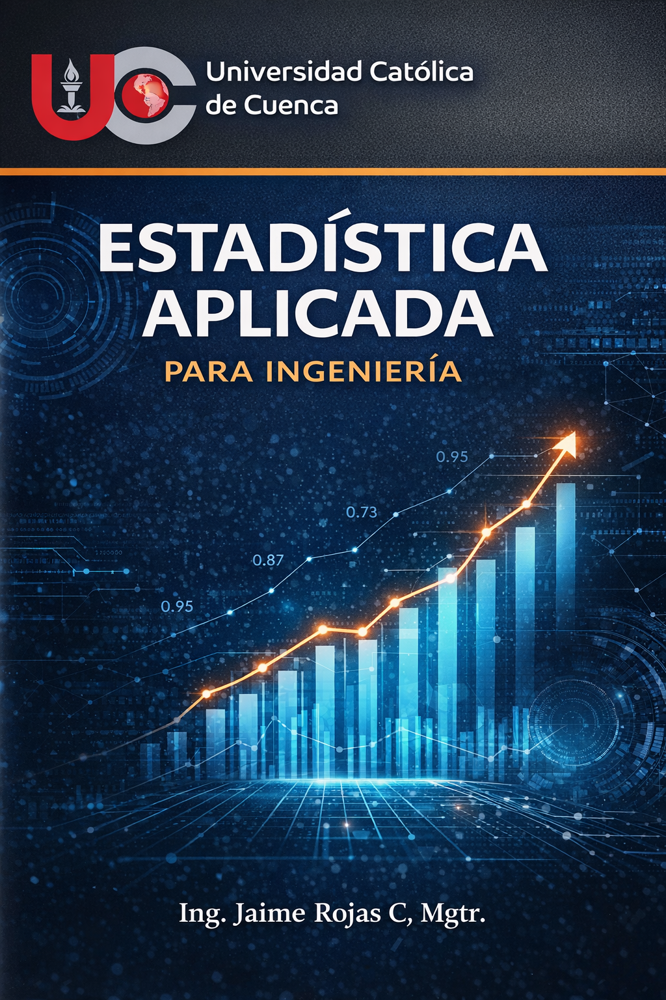
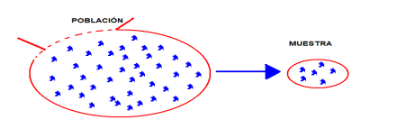

# Portada {-}

```{r portada, echo=FALSE, out.width="45%", fig.align="center"}

```

# Presentación {-}

Este libro ha sido diseñado como apoyo para la asignatura de **Estadística**.

En esta primera versión se desarrolla el **Bloque 1: Estadística Descriptiva**, que incluye la organización de datos, tablas de frecuencia, medidas descriptivas, muestreo y asociación entre variables.

## Objetivo del bloque {-}

Analizar datos estadísticos reales mediante herramientas de estadística descriptiva, incluyendo el análisis crítico e interpretación de resultados, con el propósito de sustentar decisiones informadas en contextos académicos y profesionales.

## Estructura del bloque {-}

Este bloque se organiza en los siguientes capítulos:

1. Introducción al análisis descriptivo de datos.
2. Datos y tablas de frecuencia.
3. Medidas de tendencia central y posición.
4. Medidas de dispersión.
5. Población, muestra y muestreo.
6. Medidas de asociación.

<!--chapter:end:index.Rmd-->

# Introducción al análisis descriptivo de datos

## Concepto teórico

La estadística descriptiva es el conjunto de técnicas y procedimientos que permiten **recolectar, organizar, resumir, presentar e interpretar datos** con el fin de describir un fenómeno de estudio de manera clara y útil. Su propósito principal no es generalizar resultados a toda una población, sino describir adecuadamente la información disponible en una muestra o conjunto de observaciones. En este sentido, la estadística descriptiva constituye la base para estudios posteriores de carácter inferencial.

En un estudio estadístico, las etapas fundamentales incluyen: definición del problema y de los objetivos, selección y recogida de información, organización de los datos en tablas y gráficos, resumen mediante medidas numéricas, análisis de resultados, conclusiones y, eventualmente, predicción. Estas fases muestran que la estadística no se limita a calcular fórmulas, sino que implica un proceso ordenado de razonamiento cuantitativo.

Entre los conceptos elementales destacan los siguientes:

**Población.** Es el conjunto de personas, objetos o eventos sobre los cuales interesa estudiar una o varias características. Puede ser finita o infinita según el número de elementos que la integran.

**Muestra.** Es un subconjunto de la población que se selecciona para realizar el estudio. Su tamaño se representa usualmente por \(n\). Cuando la muestra representa adecuadamente a la población, permite describirla de forma útil.

**Variable estadística.** Es la característica de interés que se observa o mide en cada elemento de la población o muestra. Los valores observados de la variable constituyen los datos.

```{r, echo=FALSE, out.width="45%", fig.align="center"}

```

Las variables pueden clasificarse en:

- **Cualitativas**, si expresan atributos o categorías.
- **Cuantitativas**, si expresan cantidades numéricas. Estas, a su vez, pueden ser:
  - **Discretas**, cuando sus valores se pueden contar.
  - **Continuas**, cuando pueden tomar cualquier valor dentro de un intervalo.

Además, las variables se estudian según su **escala de medición**:

- **Nominal**, cuando solo clasifica sin orden.
- **Ordinal**, cuando clasifica con orden.
- **De intervalo**, cuando existe distancia entre valores pero no un cero absoluto.
- **De razón**, cuando existe distancia y además un cero absoluto con significado físico.

En términos académicos y profesionales, comprender estos conceptos es esencial porque de ellos depende la correcta elección de tablas, gráficos, medidas descriptivas y modelos de análisis.

## Ejemplo aplicado

Supóngase que se desea estudiar el rendimiento académico de estudiantes de segundo ciclo de ingeniería en una asignatura de Estadística.

- **Población:** todos los estudiantes matriculados en la asignatura.
- **Muestra:** 12 estudiantes seleccionados para un análisis preliminar.
- **Variable 1:** calificación del primer parcial.
- **Variable 2:** sexo del estudiante.
- **Variable 3:** número de horas de estudio semanales.

En este contexto:

- La **calificación** es una variable cuantitativa.
- El **sexo** es una variable cualitativa nominal.
- Las **horas de estudio** son una variable cuantitativa, generalmente continua si se registran con decimales.

A continuación, se observa una pequeña muestra de datos:

```{r}
estudiante <- 1:12
calificacion <- c(7.5, 8.0, 6.8, 9.1, 7.2, 8.4, 6.5, 7.9, 8.8, 7.0, 8.2, 6.9)
sexo <- c("F", "M", "M", "F", "F", "M", "M", "F", "F", "M", "F", "M")
horas_estudio <- c(4, 5.5, 3, 7, 4.5, 6, 2.5, 5, 6.5, 3.5, 5.5, 3)

datos <- data.frame(estudiante, calificacion, sexo, horas_estudio)
datos
```

Este ejemplo muestra cómo una base de datos puede contener simultáneamente variables cualitativas y cuantitativas, y cómo cada una requiere un tratamiento estadístico adecuado.

## Implementación en R

A continuación se presenta una implementación básica en R para identificar y resumir las variables del ejemplo.

```{r}
str(datos)
```

La función `str()` permite identificar la estructura del conjunto de datos y distinguir variables numéricas y categóricas.

### Tamaño de la muestra

```{r}
nrow(datos)
```

### Resumen de la variable calificación

```{r}
summary(datos$calificacion)
```

### Frecuencia de la variable sexo

```{r}
table(datos$sexo)
```

### Promedio de horas de estudio

```{r}
mean(datos$horas_estudio)
```

### Clasificación simple de variables

```{r}
tipos_variables <- data.frame(
  Variable = c("calificacion", "sexo", "horas_estudio"),
  Tipo = c("Cuantitativa", "Cualitativa", "Cuantitativa"),
  Subtipo = c("Continua", "Nominal", "Continua")
)

tipos_variables
```

Este primer contacto con R permite al estudiante conectar los conceptos teóricos con el tratamiento computacional de los datos, lo cual es coherente con el enfoque práctico de la asignatura.

## Ejercicio propuesto

En una planta industrial se selecciona una muestra de 10 motores para registrar información técnica:

- temperatura de operación en °C,
- estado del motor (operativo, en mantenimiento, fuera de servicio),
- número de fallas detectadas en el mes.

Construya una propuesta de base de datos en R y responda:

1. ¿Cuál es la población?
2. ¿Cuál es la muestra?
3. ¿Cuáles son las variables del estudio?
4. Clasifique cada variable en cualitativa o cuantitativa.
5. En el caso de variables cuantitativas, indique si son discretas o continuas.
6. Indique la escala de medición más adecuada para cada variable.

Puede usar como guía la siguiente estructura:

```{r eval=FALSE}
motor <- 1:10
temperatura <- c(...)
estado <- c(...)
fallas <- c(...)

datos_motores <- data.frame(motor, temperatura, estado, fallas)
datos_motores
```

## Caso real (ingeniería)

En ingeniería industrial, eléctrica, civil o de telecomunicaciones, el análisis descriptivo de datos comienza siempre por una correcta definición de la población, la muestra y las variables de interés. Por ejemplo, en control de calidad puede estudiarse una población de productos fabricados; en mantenimiento, una muestra de equipos evaluados; en tránsito, un conjunto de conteos vehiculares; y en energía, mediciones de voltaje, corriente o temperatura de operación.

Si estas variables no se clasifican correctamente desde el inicio, pueden cometerse errores metodológicos importantes, como aplicar medidas numéricas a variables meramente categóricas o construir representaciones gráficas inadecuadas. Por ello, esta unidad constituye el punto de partida conceptual para todo el Bloque 1 de Estadística Descriptiva.

<!--chapter:end:01-bloque1-introduccion.Rmd-->

# Datos y tablas de frecuencia

## Concepto teórico

Los datos son observaciones recolectadas sobre una o más variables de interés en un estudio estadístico. Cuando la cantidad de datos es grande, es necesario organizarlos para facilitar su análisis.

Una de las herramientas fundamentales es la **tabla de frecuencia**, que permite resumir la información y analizar su comportamiento.

Tipos de frecuencias:

- Frecuencia absoluta (fi)
- Frecuencia relativa (hi)
- Frecuencia acumulada (Fi)
- Frecuencia relativa acumulada (Hi)

Cuando los datos son numerosos, se agrupan en intervalos definidos por:

- Límite inferior
- Límite superior
- Amplitud
- Marca de clase

El número de clases puede estimarse con la regla de Sturges:

$k = 1 + log2(n)$

## Como Agrupar los Datos 
1. Calcular el Rango de la distribución 
$R=x_{max}-x_{min}$
2. Obtener el número de clases $k$ (regla de Sturges)
3. Amplitud de clase 
$A=\frac{R}{k}$para clases de igual amplitud
4. Calcular la marca de de clase
$x_i=\frac{L_i+L_{i+1}}{2}$

---

## Ejemplo aplicado

En un proyecto de ingeniería civil se registran tiempos (minutos) de ejecución:

```{r}
tiempos <- c(42,58,79,86,98,120,134,120,59,62,
             85,89,76,110,104,78,84,96,90,75)
```

---

## Implementación en R

```{r}
n <- length(tiempos)
k <- ceiling(1 + log2(n))

R <- max(tiempos) - min(tiempos)
A <- ceiling(R / k)

intervalos <- seq(min(tiempos), max(tiempos)+A, by=A)

tabla <- table(cut(tiempos, breaks=intervalos, right=FALSE))
df <- as.data.frame(tabla)
colnames(df) <- c("Intervalo","fi")

df$Fi <- cumsum(df$fi)
df$hi <- df$fi / sum(df$fi)
df$Hi <- cumsum(df$hi)

df
```

---

## Ejercicio propuesto

Se registran niveles de producción energética (kWh):

```{r eval=FALSE}
energia <- c(12,15,18,20,22,25,30,28,26,24,
             23,21,19,17,16,14,13,12,11,10)
```

1. Determinar número de clases  
2. Calcular rango y amplitud  
3. Construir tabla de frecuencia  

---

## Caso real (ingeniería)

Las tablas de frecuencia son ampliamente utilizadas en:

- Ingeniería industrial: análisis de tiempos de producción  
- Ingeniería eléctrica: variaciones de voltaje  
- Energías renovables: producción solar/eólica  
- Ingeniería civil: tiempos y resistencia de materiales  

Permiten transformar datos en información útil para la toma de decisiones.

<!--chapter:end:02-datos-y-tablas.Rmd-->

# Representación gráfica de datos

```{r setup3, include=FALSE}
knitr::opts_chunk$set(
  echo = TRUE,
  message = FALSE,
  warning = FALSE,
  fig.align = "center",
  out.width = "85%"
)
```

## Concepto teórico

La representación gráfica de datos es una herramienta fundamental de la estadística descriptiva, ya que permite visualizar de manera rápida la distribución, concentración, dispersión y posibles patrones de un conjunto de observaciones. En ingeniería, los gráficos ayudan a transformar datos numéricos en información interpretable para la toma de decisiones técnicas.

Entre los gráficos más utilizados se encuentran:

- **Diagrama de barras**, adecuado para variables cualitativas o cuantitativas discretas.
- **Histograma**, útil para variables cuantitativas continuas o datos agrupados.
- **Polígono de frecuencias**, que resalta la forma general de la distribución.
- **Ojiva**, empleada para analizar frecuencias acumuladas.
- **Diagrama circular**, útil para mostrar proporciones en variables cualitativas.
- **Diagrama de caja y bigotes**, que permite identificar mediana, cuartiles y posibles valores atípicos.

La elección correcta del gráfico depende del tipo de variable, del tamaño de la muestra y del objetivo del análisis. En las distintas ingenierías, una mala elección del gráfico puede conducir a interpretaciones erróneas sobre eficiencia, estabilidad, calidad o comportamiento de un sistema.

## Ejemplo aplicado

En un laboratorio de energías renovables se registra la producción diaria de energía solar (kWh) durante 24 días:

```{r}
energia <- c(18, 20, 19, 22, 24, 21, 23, 25, 26, 20, 19, 18,
             17, 21, 22, 23, 24, 26, 27, 25, 22, 21, 20, 19)
energia
```

Se desea representar gráficamente estos datos para analizar su comportamiento general.

## Implementación en R

### Histograma

```{r}
hist(energia,
     col = "lightblue",
     main = "Histograma de producción diaria de energía",
     xlab = "Producción (kWh)",
     ylab = "Frecuencia",
     border = "white")
```

### Polígono de frecuencias

```{r}
frecuencias <- table(energia)
plot(as.numeric(names(frecuencias)), as.numeric(frecuencias),
     type = "b", pch = 19,
     main = "Polígono de frecuencias",
     xlab = "Producción (kWh)",
     ylab = "Frecuencia")
```

### Ojiva

```{r}
frecuencia_acumulada <- cumsum(as.numeric(frecuencias))
plot(as.numeric(names(frecuencias)), frecuencia_acumulada,
     type = "o", pch = 16,
     main = "Ojiva de producción diaria",
     xlab = "Producción (kWh)",
     ylab = "Frecuencia acumulada")
```

### Diagrama de caja

```{r}
boxplot(energia,
        horizontal = TRUE,
        col = "lightgreen",
        main = "Diagrama de caja de la producción diaria",
        xlab = "Producción (kWh)")
```

### Ejemplo con `ggplot2`

```{r}
library(ggplot2)

df_energia <- data.frame(energia = energia)

ggplot(df_energia, aes(x = energia)) +
  geom_histogram(binwidth = 2, fill = "steelblue", color = "white") +
  labs(title = "Histograma con ggplot2",
       x = "Producción (kWh)",
       y = "Frecuencia") +
  theme_minimal()
```

## Ejercicio propuesto

En una práctica de ingeniería industrial se registran los tiempos de operación (minutos) de una máquina:

```{r eval=FALSE}
tiempos <- c(42, 45, 47, 44, 43, 46, 50, 52, 48, 49,
             51, 47, 46, 45, 44, 43, 42, 48, 49, 50)
```

Realice lo siguiente:

1. Construya un histograma.
2. Elabore un polígono de frecuencias.
3. Genere la ojiva.
4. Construya un diagrama de caja.
5. Interprete cuál gráfico resulta más útil para estudiar dispersión y posibles valores atípicos.

## Caso real (ingeniería)

En **ingeniería civil**, los histogramas se emplean para analizar la resistencia a compresión del hormigón o la distribución de tiempos de ejecución de partidas de obra.

En **ingeniería eléctrica**, las ojivas ayudan a estudiar distribuciones acumuladas de voltaje, corriente o factor de potencia.

En **ingeniería industrial**, los diagramas de caja permiten comparar tiempos de proceso entre turnos o líneas de producción, identificando variabilidad y datos atípicos.

En **energías renovables**, los gráficos estadísticos facilitan el análisis de producción eólica o solar, detectando periodos de máxima generación y comportamiento irregular del sistema.

La representación gráfica adecuada es, por tanto, una herramienta visual esencial para el diagnóstico técnico y la mejora continua.

<!--chapter:end:03-bloque1-unidad3-representacion-grafica.Rmd-->

# Medidas de tendencia central y de posición

```{r setup4, include=FALSE}
knitr::opts_chunk$set(
  echo = TRUE,
  message = FALSE,
  warning = FALSE,
  fig.align = "center",
  out.width = "85%"
)
```

## Concepto teórico

Las medidas de tendencia central son valores numéricos que resumen un conjunto de datos indicando su comportamiento representativo o central. Las principales son:

- **Media aritmética**: promedio de los datos.
- **Mediana**: valor central cuando los datos se ordenan.
- **Moda**: valor que más se repite.
- **Media geométrica**: útil en tasas de crecimiento, índices y razones multiplicativas.

Por otro lado, las medidas de posición permiten dividir el conjunto de datos ordenados en partes iguales:

- **Cuartiles**: dividen en 4 partes.
- **Deciles**: dividen en 10 partes.
- **Percentiles**: dividen en 100 partes.

Estas medidas son fundamentales para comparar rendimientos, ubicar observaciones específicas dentro de una distribución y analizar comportamientos típicos en distintos contextos de ingeniería.

## Ejemplo aplicado

Se registran los consumos diarios de energía (kWh) de un pequeño sistema en 15 días:

```{r}
consumo <- c(18, 20, 19, 21, 25, 24, 22, 23, 20, 19, 18, 26, 24, 22, 21)
consumo
```

## Implementación en R

### Media, mediana y moda

```{r}
mean(consumo)
median(consumo)
```

```{r}
tabla_moda <- table(consumo)
tabla_moda
moda <- as.numeric(names(tabla_moda)[tabla_moda == max(tabla_moda)])
moda
```

### Media geométrica

```{r}
exp(mean(log(consumo)))
```

### Cuartiles

```{r}
quantile(consumo, probs = c(0.25, 0.50, 0.75))
```

### Deciles

```{r}
quantile(consumo, probs = seq(0.1, 0.9, by = 0.1))
```

### Percentiles seleccionados

```{r}
quantile(consumo, probs = c(0.10, 0.25, 0.50, 0.75, 0.90))
```

### Resumen general

```{r}
summary(consumo)
```

## Ejercicio propuesto

En una planta industrial se registran temperaturas de operación (°C) en 16 mediciones:

```{r eval=FALSE}
temperaturas <- c(68, 70, 72, 69, 71, 73, 75, 74, 70, 69, 68, 72, 71, 70, 74, 73)
```

Realice lo siguiente:

1. Calcule la media, mediana y moda.
2. Calcule la media geométrica.
3. Determine Q1, Q2 y Q3.
4. Obtenga el percentil 90.
5. Interprete los resultados desde el punto de vista técnico.

## Caso real (ingeniería)

En **ingeniería civil**, la media y la mediana se utilizan para resumir resultados de ensayos de materiales, como resistencia del hormigón o contenidos de humedad.

En **ingeniería eléctrica**, los percentiles pueden emplearse para identificar niveles críticos de carga o picos de demanda.

En **ingeniería industrial**, los cuartiles son útiles para comparar tiempos de producción entre distintos grupos de trabajo.

En **energías renovables**, la mediana y los percentiles permiten describir la generación típica y extrema de sistemas fotovoltaicos o eólicos, aportando criterios para el dimensionamiento y evaluación del desempeño.

Estas medidas no solo resumen datos, sino que ayudan a interpretar el comportamiento característico de procesos y sistemas reales.

<!--chapter:end:04-bloque1-unidad4-tendencia-central-posicion.Rmd-->

# Medidas de dispersión y forma

```{r setup5, include=FALSE}
knitr::opts_chunk$set(
  echo = TRUE,
  message = FALSE,
  warning = FALSE,
  fig.align = "center",
  out.width = "85%"
)
```

## Concepto teórico

Las medidas de dispersión cuantifican el grado de variabilidad de un conjunto de datos respecto a un valor central. Permiten determinar si los datos están concentrados o dispersos.

Principales medidas de dispersión:

- **Rango**: diferencia entre el máximo y el mínimo.
- **Varianza**: promedio de las desviaciones cuadráticas respecto a la media.
- **Desviación estándar**: raíz cuadrada de la varianza.
- **Coeficiente de variación**: relación entre la desviación estándar y la media, expresada en porcentaje.

Además, para estudiar la forma de la distribución se emplean:

- **Asimetría**: indica si la distribución es simétrica o sesgada.
- **Curtosis**: mide el grado de concentración de los datos alrededor de la media y el peso de las colas.
- **Teorema de Chebyshev**: establece que para cualquier distribución, al menos \(1 - 1/k^2\) de los datos se encuentra dentro de \(k\) desviaciones estándar de la media, con \(k > 1\).

## Ejemplo aplicado

Se registran voltajes de operación (V) en un sistema eléctrico:

```{r}
voltaje <- c(218, 220, 221, 219, 222, 223, 217, 218, 220, 221,
             224, 219, 220, 222, 223, 221, 220, 219, 218, 222)
voltaje
```

## Implementación en R

### Rango

```{r}
max(voltaje) - min(voltaje)
```

### Varianza y desviación estándar

```{r}
var(voltaje)
sd(voltaje)
```

### Coeficiente de variación

```{r}
(sd(voltaje) / mean(voltaje)) * 100
```

### Asimetría y curtosis

```{r}
library(moments)

skewness(voltaje)
kurtosis(voltaje)
```

### Aplicación del teorema de Chebyshev

```{r}
media <- mean(voltaje)
desv <- sd(voltaje)

lim_inf <- media - 2 * desv
lim_sup <- media + 2 * desv

sum(voltaje >= lim_inf & voltaje <= lim_sup) / length(voltaje)
```

## Ejercicio propuesto

En una práctica de ingeniería civil se registran resistencias a compresión (MPa) de probetas de hormigón:

```{r eval=FALSE}
resistencia <- c(24.8, 25.1, 24.5, 25.7, 26.0, 24.9, 25.3, 25.8,
                 24.7, 25.0, 25.4, 25.9, 24.6, 25.2, 25.6)
```

Realice lo siguiente:

1. Calcule rango, varianza y desviación estándar.
2. Obtenga el coeficiente de variación.
3. Calcule asimetría y curtosis.
4. Aplique el teorema de Chebyshev para \(k = 2\).
5. Interprete la estabilidad del conjunto de datos.

## Caso real (ingeniería)

En **ingeniería eléctrica**, una baja dispersión en el voltaje refleja estabilidad del sistema.

En **ingeniería industrial**, la desviación estándar permite evaluar la consistencia de tiempos de producción o dimensiones de productos fabricados.

En **ingeniería civil**, el coeficiente de variación se emplea para juzgar la uniformidad de resultados en ensayos de materiales.

En **energías renovables**, la variabilidad de la generación solar o eólica puede analizarse mediante rango, desviación estándar y asimetría, identificando condiciones de operación más o menos estables.

Las medidas de dispersión y forma son clave para pasar de una descripción superficial a una evaluación rigurosa de la estabilidad y comportamiento de los datos.

<!--chapter:end:05-bloque1-unidad5-dispersion-forma.Rmd-->

# Muestras, población y muestreo

```{r setup6, include=FALSE}
knitr::opts_chunk$set(
  echo = TRUE,
  message = FALSE,
  warning = FALSE,
  fig.align = "center",
  out.width = "85%"
)
```

## Concepto teórico

En estadística, la **población** es el conjunto total de elementos sobre los cuales se desea realizar un estudio, mientras que la **muestra** es un subconjunto de dicha población seleccionado para recolectar información.

Dado que en muchos contextos reales no es factible estudiar toda la población, se emplean técnicas de **muestreo**, que permiten obtener información representativa con menor costo y tiempo.

Principales métodos de muestreo:

- **Muestreo aleatorio simple**: todos los elementos tienen la misma probabilidad de ser seleccionados.
- **Muestreo sistemático**: se selecciona cada \(k\)-ésimo elemento de una lista.
- **Muestreo estratificado**: la población se divide en grupos homogéneos y se toma una muestra de cada uno.
- **Muestreo por conglomerados**: se divide la población en grupos naturales y se seleccionan algunos conglomerados completos.

La correcta selección de la muestra es esencial para que las conclusiones del análisis sean útiles y técnicamente válidas.

## Ejemplo aplicado

Se desea estudiar el consumo de energía de 100 viviendas de una comunidad:

```{r}
poblacion <- 1:100
```

### Muestra aleatoria simple

```{r}
set.seed(123)
sample(poblacion, 10)
```

### Muestra sistemática

```{r}
k <- 10
poblacion[seq(1, 100, by = k)]
```

### Ejemplo de muestreo estratificado

```{r}
estrato_A <- 1:40
estrato_B <- 41:70
estrato_C <- 71:100

set.seed(123)
muestra_A <- sample(estrato_A, 4)
muestra_B <- sample(estrato_B, 3)
muestra_C <- sample(estrato_C, 3)

c(muestra_A, muestra_B, muestra_C)
```

## Implementación en R

### Tamaño de la población

```{r}
length(poblacion)
```

### Generación de una muestra aleatoria

```{r}
set.seed(321)
muestra <- sample(poblacion, 12)
muestra
```

### Organización de estratos en una base simple

```{r}
datos_poblacion <- data.frame(
  vivienda = 1:12,
  sector = c("Norte", "Norte", "Norte", "Centro", "Centro", "Centro",
             "Sur", "Sur", "Sur", "Rural", "Rural", "Rural"),
  consumo = c(180, 190, 175, 210, 205, 198, 160, 170, 165, 145, 150, 148)
)

datos_poblacion
```

## Ejercicio propuesto

En una empresa de manufactura existen 120 motores divididos en tres áreas:

- Producción: 50
- Ensamble: 40
- Control: 30

Realice lo siguiente:

1. Identifique la población del estudio.
2. Diseñe una muestra aleatoria simple de tamaño 12.
3. Diseñe una muestra estratificada proporcional.
4. Explique qué método sería más apropiado si se desea representación de todas las áreas.
5. Implemente ambos métodos en R.

## Caso real (ingeniería)

En **ingeniería civil**, el muestreo se aplica al seleccionar puntos de ensayo de suelos, probetas o segmentos de una vía.

En **ingeniería eléctrica**, se utiliza para analizar equipos, circuitos o transformadores dentro de una red.

En **ingeniería industrial**, el muestreo es indispensable en control de calidad, tiempos y movimientos, e inspección de lotes.

En **energías renovables**, se emplea para seleccionar periodos de medición, equipos o ubicaciones de monitoreo de recursos energéticos.

La representatividad de la muestra es una condición esencial para que los resultados del análisis estadístico tengan validez técnica.

<!--chapter:end:06-bloque1-unidad6-muestras-poblacion-muestreo.Rmd-->

# Medidas de asociación

```{r setup7, include=FALSE}
knitr::opts_chunk$set(
  echo = TRUE,
  message = FALSE,
  warning = FALSE,
  fig.align = "center",
  out.width = "85%"
)
```

## Concepto teórico

Las medidas de asociación permiten analizar la relación entre dos variables. En estadística descriptiva, las más utilizadas son:

- **Covarianza**: mide cómo varían conjuntamente dos variables.
- **Correlación**: cuantifica la intensidad y dirección de la relación lineal entre variables.

La covarianza puede ser positiva, negativa o cercana a cero, pero su interpretación depende de las unidades de medición. Por ello, la medida más utilizada es el **coeficiente de correlación de Pearson**, cuyo valor se encuentra entre -1 y 1:

- cercano a **1**: asociación lineal positiva fuerte,
- cercano a **-1**: asociación lineal negativa fuerte,
- cercano a **0**: relación lineal débil o inexistente.

Estas medidas son especialmente útiles para estudiar relaciones entre variables técnicas, operativas y de desempeño en distintas ramas de la ingeniería.

## Ejemplo aplicado

Se analiza la relación entre horas de funcionamiento y consumo de energía de un equipo:

```{r}
horas <- c(2, 3, 4, 5, 6, 7, 8, 9, 10, 11)
consumo <- c(15, 18, 20, 24, 26, 29, 33, 35, 38, 41)

datos <- data.frame(horas, consumo)
datos
```

## Implementación en R

### Covarianza

```{r}
cov(horas, consumo)
```

### Correlación

```{r}
cor(horas, consumo)
```

### Diagrama de dispersión

```{r}
plot(horas, consumo,
     pch = 19,
     col = "blue",
     main = "Horas de funcionamiento vs consumo",
     xlab = "Horas de funcionamiento",
     ylab = "Consumo de energía")
abline(lm(consumo ~ horas), col = "red", lwd = 2)
```

### Correlación con `ggplot2`

```{r}
library(ggplot2)

ggplot(datos, aes(x = horas, y = consumo)) +
  geom_point(color = "steelblue", size = 3) +
  geom_smooth(method = "lm", se = FALSE, color = "red") +
  labs(title = "Relación entre horas de funcionamiento y consumo",
       x = "Horas",
       y = "Consumo") +
  theme_minimal()
```

## Ejercicio propuesto

En un sistema de bombeo se registran caudal (L/s) y consumo eléctrico (kW) en distintas condiciones de operación:

```{r eval=FALSE}
caudal <- c(12, 14, 15, 17, 18, 20, 21, 23, 24, 26)
potencia <- c(4.5, 5.0, 5.2, 5.8, 6.0, 6.5, 6.8, 7.2, 7.4, 7.9)
```

Realice lo siguiente:

1. Calcule la covarianza.
2. Calcule el coeficiente de correlación.
3. Construya un diagrama de dispersión.
4. Interprete si existe asociación lineal entre las variables.
5. Explique el significado técnico del resultado.

## Caso real (ingeniería)

En **ingeniería civil**, la correlación puede usarse para estudiar la relación entre contenido de humedad y resistencia del suelo, o entre carga y deformación.

En **ingeniería eléctrica**, permite analizar la asociación entre carga y consumo energético, o entre corriente y temperatura de operación.

En **ingeniería industrial**, se utiliza para relacionar tiempo de producción con número de unidades fabricadas o nivel de desperdicio.

En **energías renovables**, es útil para estudiar la relación entre irradiancia solar y producción fotovoltaica, o entre velocidad del viento y potencia generada.

Estas medidas ayudan a identificar relaciones clave entre variables, sentando bases para análisis posteriores como la regresión lineal del siguiente bloque.

<!--chapter:end:07-bloque1-unidad7-medidas-asociacion.Rmd-->

