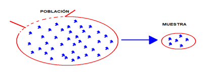

# Portada {-}
```{r setup, include=FALSE}
knitr::opts_chunk$set(
  echo = TRUE,
  message = FALSE,
  warning = FALSE,
  fig.align = "center",
  out.width = "85%"
)
```

```{r portada, echo=FALSE, out.width="45%", fig.align="center"}

```

# Presentación {-}

Este libro ha sido diseñado como apoyo para la asignatura de **Estadística**.

En esta primera versión se desarrolla el **Bloque 1: Estadística Descriptiva**, que incluye la organización de datos, tablas de frecuencia, medidas descriptivas, muestreo y asociación entre variables.

## Objetivo del bloque {-}

Analizar datos estadísticos reales mediante herramientas de estadística descriptiva, incluyendo el análisis crítico e interpretación de resultados, con el propósito de sustentar decisiones informadas en contextos académicos y profesionales.

## Estructura del bloque {-}

Este bloque se organiza en los siguientes capítulos:

1. Introducción al análisis descriptivo de datos.
2. Datos y tablas de frecuencia.
3. Medidas de tendencia central y posición.
4. Medidas de dispersión.
5. Población, muestra y muestreo.
6. Medidas de asociación.


<!--chapter:end:index.Rmd-->

---
output:
  pdf_document: default
  html_document: default
---
# Introducción al análisis descriptivo de datos

## Concepto teórico

La estadística descriptiva es el conjunto de técnicas y procedimientos que permiten **recolectar, organizar, resumir, presentar e interpretar datos** con el fin de describir un fenómeno de estudio de manera clara y útil. Su propósito principal no es generalizar resultados a toda una población, sino describir adecuadamente la información disponible en una muestra o conjunto de observaciones. En este sentido, la estadística descriptiva constituye la base para estudios posteriores de carácter inferencial.

En un estudio estadístico, las etapas fundamentales incluyen: definición del problema y de los objetivos, selección y recogida de información, organización de los datos en tablas y gráficos, resumen mediante medidas numéricas, análisis de resultados, conclusiones y, eventualmente, predicción. Estas fases muestran que la estadística no se limita a calcular fórmulas, sino que implica un proceso ordenado de razonamiento cuantitativo.

Entre los conceptos elementales destacan los siguientes:

**Población.** Es el conjunto de personas, objetos o eventos sobre los cuales interesa estudiar una o varias características. Puede ser finita o infinita según el número de elementos que la integran.

**Muestra.** Es un subconjunto de la población que se selecciona para realizar el estudio. Su tamaño se representa usualmente por \(n\). Cuando la muestra representa adecuadamente a la población, permite describirla de forma útil.

**Variable estadística.** Es la característica de interés que se observa o mide en cada elemento de la población o muestra. Los valores observados de la variable constituyen los datos.

```{r, echo=FALSE, out.width="45%", fig.align="center"}

```

Las variables pueden clasificarse en:

- **Cualitativas**, si expresan atributos o categorías.
- **Cuantitativas**, si expresan cantidades numéricas. Estas, a su vez, pueden ser:
  - **Discretas**, cuando sus valores se pueden contar.
  - **Continuas**, cuando pueden tomar cualquier valor dentro de un intervalo.

Además, las variables se estudian según su **escala de medición**:

- **Nominal**, cuando solo clasifica sin orden.
- **Ordinal**, cuando clasifica con orden.
- **De intervalo**, cuando existe distancia entre valores pero no un cero absoluto.
- **De razón**, cuando existe distancia y además un cero absoluto con significado físico.

En términos académicos y profesionales, comprender estos conceptos es esencial porque de ellos depende la correcta elección de tablas, gráficos, medidas descriptivas y modelos de análisis.

## Ejemplo aplicado

Supóngase que se desea estudiar el rendimiento académico de estudiantes de segundo ciclo de ingeniería en una asignatura de Estadística.

- **Población:** todos los estudiantes matriculados en la asignatura.
- **Muestra:** 12 estudiantes seleccionados para un análisis preliminar.
- **Variable 1:** calificación del primer parcial.
- **Variable 2:** sexo del estudiante.
- **Variable 3:** número de horas de estudio semanales.

En este contexto:

- La **calificación** es una variable cuantitativa.
- El **sexo** es una variable cualitativa nominal.
- Las **horas de estudio** son una variable cuantitativa, generalmente continua si se registran con decimales.

A continuación, se observa una pequeña muestra de datos:

```{r}
estudiante <- 1:12
calificacion <- c(7.5, 8.0, 6.8, 9.1, 7.2, 8.4, 6.5, 7.9, 8.8, 7.0, 8.2, 6.9)
sexo <- c("F", "M", "M", "F", "F", "M", "M", "F", "F", "M", "F", "M")
horas_estudio <- c(4, 5.5, 3, 7, 4.5, 6, 2.5, 5, 6.5, 3.5, 5.5, 3)

datos <- data.frame(estudiante, calificacion, sexo, horas_estudio)
datos
```

Este ejemplo muestra cómo una base de datos puede contener simultáneamente variables cualitativas y cuantitativas, y cómo cada una requiere un tratamiento estadístico adecuado.

## Implementación en R

A continuación se presenta una implementación básica en R para identificar y resumir las variables del ejemplo.

```{r}
str(datos)
```

La función `str()` permite identificar la estructura del conjunto de datos y distinguir variables numéricas y categóricas.

### Tamaño de la muestra

```{r}
nrow(datos)
```

### Resumen de la variable calificación

```{r}
summary(datos$calificacion)
```

### Frecuencia de la variable sexo

```{r}
table(datos$sexo)
```

### Promedio de horas de estudio

```{r}
mean(datos$horas_estudio)
```

### Clasificación simple de variables

```{r}
tipos_variables <- data.frame(
  Variable = c("calificacion", "sexo", "horas_estudio"),
  Tipo = c("Cuantitativa", "Cualitativa", "Cuantitativa"),
  Subtipo = c("Continua", "Nominal", "Continua")
)

tipos_variables
```

Este primer contacto con R permite al estudiante conectar los conceptos teóricos con el tratamiento computacional de los datos, lo cual es coherente con el enfoque práctico de la asignatura.

## Ejercicio propuesto

En una planta industrial se selecciona una muestra de 10 motores para registrar información técnica:

- temperatura de operación en °C,
- estado del motor (operativo, en mantenimiento, fuera de servicio),
- número de fallas detectadas en el mes.

Construya una propuesta de base de datos en R y responda:

1. ¿Cuál es la población?
2. ¿Cuál es la muestra?
3. ¿Cuáles son las variables del estudio?
4. Clasifique cada variable en cualitativa o cuantitativa.
5. En el caso de variables cuantitativas, indique si son discretas o continuas.
6. Indique la escala de medición más adecuada para cada variable.

Puede usar como guía la siguiente estructura:

```{r eval=FALSE}
motor <- 1:10
temperatura <- c(...)
estado <- c(...)
fallas <- c(...)

datos_motores <- data.frame(motor, temperatura, estado, fallas)
datos_motores
```

## Caso real (ingeniería)

En ingeniería industrial, eléctrica, civil o de telecomunicaciones, el análisis descriptivo de datos comienza siempre por una correcta definición de la población, la muestra y las variables de interés. Por ejemplo, en control de calidad puede estudiarse una población de productos fabricados; en mantenimiento, una muestra de equipos evaluados; en tránsito, un conjunto de conteos vehiculares; y en energía, mediciones de voltaje, corriente o temperatura de operación.

Si estas variables no se clasifican correctamente desde el inicio, pueden cometerse errores metodológicos importantes, como aplicar medidas numéricas a variables meramente categóricas o construir representaciones gráficas inadecuadas. Por ello, esta unidad constituye el punto de partida conceptual para todo el Bloque 1 de Estadística Descriptiva.

<!--chapter:end:01-bloque1-introduccion.Rmd-->

# Datos y tablas de frecuencia

## Concepto teórico

Los datos son observaciones recolectadas sobre una o más variables de interés en un estudio estadístico. Cuando la cantidad de datos es grande, es necesario organizarlos para facilitar su análisis.

Una de las herramientas fundamentales es la **tabla de frecuencia**, que permite resumir la información y analizar su comportamiento.

Tipos de frecuencias:

- Frecuencia absoluta (fi)
- Frecuencia relativa (hi)
- Frecuencia acumulada (Fi)
- Frecuencia relativa acumulada (Hi)

Cuando los datos son numerosos, se agrupan en intervalos definidos por:

- Límite inferior
- Límite superior
- Amplitud
- Marca de clase

El número de clases puede estimarse con la regla de Sturges:

$k = 1 + log2(n)$

## Como Agrupar los Datos 
1. Calcular el Rango de la distribución 
$R=x_{max}-x_{min}$
2. Obtener el número de clases $k$ (regla de Sturges)
3. Amplitud de clase 
$A=\frac{R}{k}$para clases de igual amplitud
4. Calcular la marca de de clase
$x_i=\frac{L_i+L_{i+1}}{2}$

---

## Ejemplo aplicado

En un proyecto de ingeniería civil se registran tiempos (minutos) de ejecución:

```{r}
tiempos <- c(42,58,79,86,98,120,134,120,59,62,
             85,89,76,110,104,78,84,96,90,75)
```

---

## Implementación en R

```{r}
n <- length(tiempos)
k <- ceiling(1 + log2(n))

R <- max(tiempos) - min(tiempos)
A <- ceiling(R / k)

intervalos <- seq(min(tiempos), max(tiempos)+A, by=A)

tabla <- table(cut(tiempos, breaks=intervalos, right=FALSE))
df <- as.data.frame(tabla)
colnames(df) <- c("Intervalo","fi")

df$Fi <- cumsum(df$fi)
df$hi <- df$fi / sum(df$fi)
df$Hi <- cumsum(df$hi)

df
```

---

## Ejercicio propuesto

Se registran niveles de producción energética (kWh):

```{r eval=FALSE}
energia <- c(12,15,18,20,22,25,30,28,26,24,
             23,21,19,17,16,14,13,12,11,10)
```

1. Determinar número de clases  
2. Calcular rango y amplitud  
3. Construir tabla de frecuencia  

---

## Caso real (ingeniería)

Las tablas de frecuencia son ampliamente utilizadas en:

- Ingeniería industrial: análisis de tiempos de producción  
- Ingeniería eléctrica: variaciones de voltaje  
- Energías renovables: producción solar/eólica  
- Ingeniería civil: tiempos y resistencia de materiales  

Permiten transformar datos en información útil para la toma de decisiones.

<!--chapter:end:02-datos-y-tablas.Rmd-->

# Representación gráfica de datos

## Concepto teórico

La representación gráfica de datos es una herramienta esencial de la estadística descriptiva porque permite resumir visualmente la información, identificar patrones, detectar valores atípicos y comparar distribuciones. En contextos de ingeniería, los gráficos ayudan a interpretar el comportamiento de variables como tiempos de producción, consumos energéticos, resistencia de materiales, temperaturas, voltajes o caudales.

La elección del gráfico depende del tipo de variable y del objetivo del análisis. Entre las representaciones más utilizadas se encuentran:

### Diagrama de barras

Se utiliza principalmente para variables cualitativas o cuantitativas discretas. Cada barra representa una categoría o valor y su altura es proporcional a la frecuencia.

### Histograma

Se emplea para variables cuantitativas continuas o datos agrupados en intervalos. A diferencia del diagrama de barras, en el histograma las barras se presentan unidas, reflejando continuidad.

Si \(f_i\) representa la frecuencia de la clase \(i\), entonces cada barra resume el número de observaciones contenidas en el intervalo correspondiente.

### Polígono de frecuencias

Los polígonos de frecuencias son análogos a los gráficos de líneas y, al igual que los gráficos de líneas facilitan la interpretación visual de los datos continuos, también lo hacen los polígonos de frecuencias.

Para construir un polígono de frecuencias, primero hay que examinar los datos y decidir el número de intervalos, o intervalos de clase, que se van a utilizar en los ejes x y y. Después de elegir los rangos apropiados, comience a trazar los puntos de datos. Después de trazar todos los puntos, dibuje segmentos de línea para conectarlos.

Se construye uniendo con segmentos de recta las marcas de clase \((x_i)\) con sus frecuencias \((f_i)\). Es útil para visualizar la forma general de la distribución y comparar varios conjuntos de datos.

### Ojiva

La ojiva representa las frecuencias acumuladas. Si \(F_i\) es la frecuencia acumulada hasta la clase \(i\), entonces:

\[
F_i = \sum_{j=1}^{i} f_j
\]

Este gráfico es útil para responder preguntas del tipo: “¿cuántos datos son menores o iguales que cierto valor?”

### Diagrama de caja y bigotes

Los diagramas de caja (también llamados diagramas de caja y bigotes o gráficos de caja y bigotes) ofrecen una buena imagen gráfica de la concentración de los datos. También muestran lo lejos que están los valores extremos de la mayoría de los datos. Un diagrama de caja se construye a partir de cinco valores: el valor mínimo, el primer cuartil, la mediana, el tercer cuartil y el valor máximo. Utilizamos estos valores para comparar la proximidad de otros valores de datos.

Para construir un diagrama de caja, utilice una línea numérica horizontal o vertical y una caja rectangular. Los valores de datos más pequeños y más grandes marcan los puntos finales del eje. El primer cuartil marca un extremo de la caja y el tercer cuartil marca el otro extremo de la caja. Aproximadamente el 50 % de los datos están dentro de la caja. Los "bigotes" se extienden desde los extremos de la caja hasta los valores de datos más pequeños y más grandes. La mediana o el segundo cuartil pueden estar entre el primer y el tercer cuartil, o puede ser uno, el otro, o ambos. El diagrama de caja ofrece una buena y rápida imagen de los datos.
Resume visualmente la distribución mediante el mínimo, primer cuartil \(Q_1\), mediana \(Q_2\), tercer cuartil \(Q_3\) y máximo. También permite identificar posibles valores atípicos.Es posible que encuentre diagramas de caja y bigotes con puntos que marcan los valores atípicos. En esos casos, los bigotes no se extienden hasta los valores mínimos y máximos.

En ingeniería, estas representaciones permiten detectar comportamientos anómalos, comparar desempeño entre sistemas y apoyar decisiones técnicas basadas en evidencia.

## Ejemplo aplicado

En un laboratorio de energías renovables se registra la producción diaria de energía solar (kWh) durante 24 días:

```{r}
energia <- c(18, 20, 19, 22, 24, 21, 23, 25, 26, 20, 19, 18,
             17, 21, 22, 23, 24, 26, 27, 25, 22, 21, 20, 19)
energia
```

El objetivo es representar gráficamente los datos para interpretar su distribución.

## Implementación en R

### Histograma

```{r}
hist(energia,
     col = "red",
     main = "Histograma de producción diaria de energía",
     xlab = "Producción (kWh)",
     ylab = "Frecuencia",
     border = "white")
```

### Polígono de frecuencias

```{r}
frecuencias <- table(energia)
plot(as.numeric(names(frecuencias)), as.numeric(frecuencias),
     type = "b", pch = 19,
     main = "Polígono de frecuencias",
     xlab = "Producción (kWh)",
     ylab = "Frecuencia")
```

### Ojiva

```{r}
frecuencia_acumulada <- cumsum(as.numeric(frecuencias))
plot(as.numeric(names(frecuencias)), frecuencia_acumulada,
     type = "o", pch = 16,
     main = "Ojiva de producción diaria",
     xlab = "Producción (kWh)",
     ylab = "Frecuencia acumulada")
```

### Diagrama de caja

```{r}
boxplot(energia,
        horizontal = TRUE,
        col = "lightgreen",
        main = "Diagrama de caja de la producción diaria",
        xlab = "Producción (kWh)")
```

### Ejemplo con `ggplot2`

```{r}
library(ggplot2)

df_energia <- data.frame(energia = energia)

ggplot(df_energia, aes(x = energia)) +
  geom_histogram(binwidth = 2, fill = "steelblue", color = "white") +
  labs(title = "Histograma con ggplot2",
       x = "Producción (kWh)",
       y = "Frecuencia") +
  theme_minimal()
```

## Ejercicio propuesto

En una práctica de ingeniería industrial se registran los tiempos de operación (minutos) de una máquina:

```{r eval=FALSE}
tiempos <- c(42, 45, 47, 44, 43, 46, 50, 52, 48, 49,
             51, 47, 46, 45, 44, 43, 42, 48, 49, 50)
```

Realice lo siguiente:

1. Construya un histograma.
2. Elabore un polígono de frecuencias.
3. Genere la ojiva.
4. Construya un diagrama de caja.
5. Interprete cuál gráfico resulta más útil para estudiar dispersión y posibles valores atípicos.

## Caso real (ingeniería)

En **ingeniería civil**, los histogramas se utilizan para analizar la resistencia a compresión del hormigón, la variación en dimensiones de elementos prefabricados o la distribución de tiempos de ejecución de partidas de obra.

En **ingeniería eléctrica**, las ojivas ayudan a estudiar distribuciones acumuladas de voltaje, corriente o factor de potencia.

En **ingeniería industrial**, los diagramas de caja permiten comparar tiempos de proceso entre turnos o líneas de producción, identificando variabilidad y datos atípicos.

En **energías renovables**, los gráficos estadísticos facilitan el análisis de producción eólica o solar, detectando periodos de máxima generación y comportamiento irregular del sistema.

La representación gráfica adecuada permite transformar datos en evidencia visual útil para el diagnóstico técnico y la mejora continua.

<!--chapter:end:03-bloque1-unidad3-representacion-grafica.Rmd-->

# Medidas de tendencia central y de posición

## Concepto teórico

Las medidas de tendencia central son estadísticas que resumen un conjunto de datos mediante un valor representativo de su comportamiento general. Las más importantes son la media, la mediana, la moda y, en ciertos contextos, la media geométrica.

### Media aritmética

La media aritmética o promedio se define como:

\[
\bar{x} = \frac{1}{n}\sum_{i=1}^{n} x_i
\]

donde \(x_i\) representa cada observación y \(n\) el número total de datos.

La media es sensible a valores extremos, por lo que resulta muy útil cuando la distribución es aproximadamente simétrica.

### Mediana

La mediana es el valor central del conjunto de datos una vez que estos se ordenan. Divide a la muestra en dos partes iguales. Es una medida robusta frente a valores atípicos.

### Moda

La moda es el valor que más veces se repite en el conjunto de datos. Puede existir una moda, varias modas o no existir si no hay repeticiones.

### Media geométrica

Se utiliza especialmente en tasas de crecimiento, índices y magnitudes multiplicativas:

\[
G = \sqrt[n]{x_1x_2x_3\cdots x_n}
\]

También puede calcularse como:

\[
G = \exp\left(\frac{1}{n}\sum_{i=1}^{n}\ln(x_i)\right)
\]

### Medidas de posición

Estas medidas permiten ubicar observaciones dentro de una distribución ordenada.

- **Cuartiles**: dividen los datos en 4 partes iguales.
- **Deciles**: dividen los datos en 10 partes iguales.
- **Percentiles**: dividen los datos en 100 partes iguales.

Son útiles para comparar el desempeño relativo de una observación respecto al total del grupo.

## Ejemplo aplicado

Se registran los consumos diarios de energía (kWh) de un pequeño sistema durante 15 días:

```{r}
consumo <- c(18, 20, 19, 21, 25, 24, 22, 23, 20, 19, 18, 26, 24, 22, 21)
consumo
```

## Implementación en R

### Media, mediana y moda

```{r}
mean(consumo)
median(consumo)
```

```{r}
tabla_moda <- table(consumo)
tabla_moda
moda <- as.numeric(names(tabla_moda)[tabla_moda == max(tabla_moda)])
moda
```

### Media geométrica

```{r}
exp(mean(log(consumo)))
```

### Cuartiles

```{r}
quantile(consumo, probs = c(0.25, 0.50, 0.75))
```

### Deciles

```{r}
quantile(consumo, probs = seq(0.1, 0.9, by = 0.1))
```

### Percentiles seleccionados

```{r}
quantile(consumo, probs = c(0.10, 0.25, 0.50, 0.75, 0.90))
```

### Gráfico interpretativo

```{r}
hist(consumo, col = "lightblue", main = "Histograma del consumo diario",
     xlab = "Consumo (kWh)", ylab = "Frecuencia")
abline(v = mean(consumo), col = "red", lwd = 2)
abline(v = median(consumo), col = "darkgreen", lwd = 2)
legend("topright", legend = c("Media", "Mediana"),
       col = c("red", "darkgreen"), lwd = 2)
```

## Ejercicio propuesto

En una planta industrial se registran temperaturas de operación (°C) en 16 mediciones:

```{r eval=FALSE}
temperaturas <- c(68, 70, 72, 69, 71, 73, 75, 74, 70, 69, 68, 72, 71, 70, 74, 73)
```

Realice lo siguiente:

1. Calcule la media, mediana y moda.
2. Calcule la media geométrica.
3. Determine \(Q_1\), \(Q_2\) y \(Q_3\).
4. Obtenga el percentil 90.
5. Interprete los resultados desde el punto de vista técnico.

## Caso real (ingeniería)

En **ingeniería civil**, la media y la mediana se utilizan para resumir resultados de ensayos de materiales, como resistencia del hormigón o contenidos de humedad.

En **ingeniería eléctrica**, los percentiles pueden emplearse para identificar niveles críticos de carga o picos de demanda.

En **ingeniería industrial**, los cuartiles son útiles para comparar tiempos de producción entre distintos grupos de trabajo.

En **energías renovables**, la mediana y los percentiles permiten describir la generación típica y extrema de sistemas fotovoltaicos o eólicos, aportando criterios para el dimensionamiento y evaluación del desempeño.

Estas medidas ayudan a interpretar el comportamiento característico de procesos y sistemas reales, más allá de la simple observación de los datos.

<!--chapter:end:04-bloque1-unidad4-tendencia-central-posicion.Rmd-->

# Medidas de dispersión y forma

## Concepto teórico

Las medidas de dispersión indican cuánto se alejan los datos respecto a un valor central. Mientras las medidas de tendencia central responden dónde se concentran los datos, las de dispersión indican qué tan homogéneo o variable es el conjunto.

### Rango

Es la diferencia entre el valor máximo y el mínimo:

\[
R = x_{\max} - x_{\min}
\]

### Varianza

La varianza muestral se define como:

\[
s^2 = \frac{\sum_{i=1}^{n}(x_i - \bar{x})^2}{n-1}
\]

Mide la dispersión cuadrática de los datos respecto a la media.

### Desviación estándar

Es la raíz cuadrada de la varianza:

\[
s = \sqrt{s^2}
\]

Tiene la ventaja de expresarse en las mismas unidades que los datos originales.

### Coeficiente de variación

Permite comparar dispersión relativa entre conjuntos de datos con distintas escalas:

\[
CV = \frac{s}{\bar{x}} \times 100
\]

### Asimetría

Indica si la distribución es simétrica o si presenta sesgo hacia la izquierda o hacia la derecha.

### Curtosis

Mide el grado de concentración de los datos alrededor de la media y el peso de las colas de la distribución.

### Teorema de Chebyshev

Para cualquier conjunto de datos y para \(k > 1\), al menos:

\[
1 - \frac{1}{k^2}
\]

de las observaciones se encuentra dentro del intervalo:

\[
\bar{x} \pm ks
\]

Este teorema es útil cuando no se conoce la forma exacta de la distribución.

## Ejemplo aplicado

Se registran voltajes de operación (V) en un sistema eléctrico:

```{r}
voltaje <- c(218, 220, 221, 219, 222, 223, 217, 218, 220, 221,
             224, 219, 220, 222, 223, 221, 220, 219, 218, 222)
voltaje
```

## Implementación en R

### Rango

```{r}
max(voltaje) - min(voltaje)
```

### Varianza y desviación estándar

```{r}
var(voltaje)
sd(voltaje)
```

### Coeficiente de variación

```{r}
(sd(voltaje) / mean(voltaje)) * 100
```

### Asimetría y curtosis

```{r}
library(moments)

skewness(voltaje)
kurtosis(voltaje)
```

### Aplicación del teorema de Chebyshev para \(k = 2\)

```{r}
media <- mean(voltaje)
desv <- sd(voltaje)

lim_inf <- media - 2 * desv
lim_sup <- media + 2 * desv

sum(voltaje >= lim_inf & voltaje <= lim_sup) / length(voltaje)
```

### Visualización de la dispersión

```{r}
hist(voltaje, col = "lightgray", main = "Distribución del voltaje",
     xlab = "Voltaje (V)", ylab = "Frecuencia")
abline(v = mean(voltaje), col = "red", lwd = 2)
```

## Ejercicio propuesto

En una práctica de ingeniería civil se registran resistencias a compresión (MPa) de probetas de hormigón:

```{r eval=FALSE}
resistencia <- c(24.8, 25.1, 24.5, 25.7, 26.0, 24.9, 25.3, 25.8,
                 24.7, 25.0, 25.4, 25.9, 24.6, 25.2, 25.6)
```

Realice lo siguiente:

1. Calcule rango, varianza y desviación estándar.
2. Obtenga el coeficiente de variación.
3. Calcule asimetría y curtosis.
4. Aplique el teorema de Chebyshev para \(k = 2\).
5. Interprete la estabilidad del conjunto de datos.

## Caso real (ingeniería)

En **ingeniería eléctrica**, una baja dispersión en el voltaje indica estabilidad del sistema y menor probabilidad de fallos.

En **ingeniería industrial**, la desviación estándar permite evaluar la consistencia de tiempos de producción, masas, dimensiones o consumos.

En **ingeniería civil**, el coeficiente de variación se usa para juzgar la uniformidad de resultados en ensayos de materiales.

En **energías renovables**, la variabilidad de la generación solar o eólica puede analizarse mediante rango, desviación estándar y asimetría, identificando condiciones de operación estables o inestables.

Estas medidas permiten pasar de una descripción básica a una evaluación rigurosa de la confiabilidad de los datos.

<!--chapter:end:05-bloque1-unidad5-dispersion-forma.Rmd-->

# Muestras, población y muestreo

## Concepto teórico

En estadística, la **población** es el conjunto total de elementos sobre los cuales se desea realizar un estudio, mientras que la **muestra** es un subconjunto de la población seleccionado para recolectar información.

Cuando estudiar toda la población resulta costoso o impracticable, se recurre al muestreo. La calidad del análisis depende en gran medida de que la muestra sea representativa.

### Muestreo aleatorio simple

Cada elemento de la población tiene la misma probabilidad de ser seleccionado:

\[
P(\text{selección}) = \frac{1}{N}
\]

donde \(N\) es el tamaño de la población.

### Muestreo sistemático

Se selecciona cada \(k\)-ésimo elemento de la población ordenada, donde:

\[
k = \frac{N}{n}
\]

siendo \(n\) el tamaño de la muestra.

### Muestreo estratificado

La población se divide en estratos homogéneos y se toma una muestra de cada uno. Es útil cuando se desea representación de todos los subgrupos importantes.

### Muestreo por conglomerados

La población se divide en grupos naturales y se seleccionan algunos conglomerados completos. Se usa mucho cuando la población está distribuida geográficamente.

## Ejemplo aplicado

Se desea estudiar el consumo de energía de 100 viviendas de una comunidad:

```{r}
poblacion <- 1:100
```

### Muestra aleatoria simple

```{r}
set.seed(123)
sample(poblacion, 10)
```

### Muestra sistemática

```{r}
k <- 10
poblacion[seq(1, 100, by = k)]
```

### Ejemplo de muestreo estratificado

```{r}
estrato_A <- 1:40
estrato_B <- 41:70
estrato_C <- 71:100

set.seed(123)
muestra_A <- sample(estrato_A, 4)
muestra_B <- sample(estrato_B, 3)
muestra_C <- sample(estrato_C, 3)

c(muestra_A, muestra_B, muestra_C)
```

## Implementación en R

### Tamaño de la población

```{r}
length(poblacion)
```

### Generación de una muestra aleatoria

```{r}
set.seed(321)
muestra <- sample(poblacion, 12)
muestra
```

### Visualización simple de una muestra

```{r}
plot(sample(1:100, 20), pch = 19, col = "blue",
     main = "Ejemplo de muestra aleatoria",
     xlab = "Posición", ylab = "Elemento seleccionado")
```

### Organización de estratos en una base simple

```{r}
datos_poblacion <- data.frame(
  vivienda = 1:12,
  sector = c("Norte", "Norte", "Norte", "Centro", "Centro", "Centro",
             "Sur", "Sur", "Sur", "Rural", "Rural", "Rural"),
  consumo = c(180, 190, 175, 210, 205, 198, 160, 170, 165, 145, 150, 148)
)

datos_poblacion
```

## Ejercicio propuesto

En una empresa de manufactura existen 120 motores divididos en tres áreas:

- Producción: 50
- Ensamble: 40
- Control: 30

Realice lo siguiente:

1. Identifique la población del estudio.
2. Diseñe una muestra aleatoria simple de tamaño 12.
3. Diseñe una muestra estratificada proporcional.
4. Explique qué método sería más apropiado si se desea representación de todas las áreas.
5. Implemente ambos métodos en R.

## Caso real (ingeniería)

En **ingeniería civil**, el muestreo se aplica al seleccionar puntos de ensayo de suelos, probetas o segmentos de una vía.

En **ingeniería eléctrica**, se utiliza para analizar equipos, circuitos o transformadores dentro de una red.

En **ingeniería industrial**, el muestreo es indispensable en control de calidad, tiempos y movimientos e inspección de lotes.

En **energías renovables**, se emplea para seleccionar periodos de medición, equipos o ubicaciones de monitoreo de recursos energéticos.

Una muestra bien seleccionada garantiza que las conclusiones del análisis estadístico tengan validez técnica y utilidad práctica.

<!--chapter:end:06-bloque1-unidad6-muestras-poblacion-muestreo.Rmd-->

# Medidas de asociación

## Concepto teórico

Las medidas de asociación permiten estudiar cómo se relacionan dos variables. En estadística descriptiva, las más importantes son la covarianza y la correlación.

### Covarianza

La covarianza mide la variación conjunta entre dos variables \(X\) y \(Y\):

\[
Cov(X,Y) = \frac{\sum_{i=1}^{n}(x_i - \bar{x})(y_i - \bar{y})}{n-1}
\]

- Si la covarianza es positiva, ambas variables tienden a aumentar juntas.
- Si es negativa, cuando una aumenta la otra tiende a disminuir.
- Si es cercana a cero, no hay una relación lineal clara.

La covarianza depende de las unidades de medida, por lo que su interpretación directa suele ser limitada.

### Correlación de Pearson

La correlación estandariza la covarianza y toma valores entre -1 y 1:

\[
r = \frac{Cov(X,Y)}{s_x s_y}
\]

donde \(s_x\) y \(s_y\) son las desviaciones estándar de \(X\) y \(Y\).

Interpretación general:

- \(r \approx 1\): asociación lineal positiva fuerte
- \(r \approx -1\): asociación lineal negativa fuerte
- \(r \approx 0\): relación lineal débil o inexistente

El análisis de asociación es importante porque ayuda a identificar variables relacionadas y prepara el camino para el estudio de regresión lineal.

## Ejemplo aplicado

Se analiza la relación entre horas de funcionamiento y consumo de energía de un equipo:

```{r}
horas <- c(2, 3, 4, 5, 6, 7, 8, 9, 10, 11)
consumo <- c(15, 18, 20, 24, 26, 29, 33, 35, 38, 41)

datos <- data.frame(horas, consumo)
datos
```

## Implementación en R

### Covarianza

```{r}
cov(horas, consumo)
```

### Correlación

```{r}
cor(horas, consumo)
```

### Diagrama de dispersión

```{r}
plot(horas, consumo,
     pch = 19,
     col = "blue",
     main = "Horas de funcionamiento vs consumo",
     xlab = "Horas de funcionamiento",
     ylab = "Consumo de energía")
abline(lm(consumo ~ horas), col = "red", lwd = 2)
```

### Correlación con `ggplot2`

```{r}
library(ggplot2)

ggplot(datos, aes(x = horas, y = consumo)) +
  geom_point(color = "steelblue", size = 3) +
  geom_smooth(method = "lm", se = FALSE, color = "red") +
  labs(title = "Relación entre horas de funcionamiento y consumo",
       x = "Horas",
       y = "Consumo") +
  theme_minimal()
```

## Ejercicio propuesto

En un sistema de bombeo se registran caudal (L/s) y consumo eléctrico (kW) en distintas condiciones de operación:

```{r eval=FALSE}
caudal <- c(12, 14, 15, 17, 18, 20, 21, 23, 24, 26)
potencia <- c(4.5, 5.0, 5.2, 5.8, 6.0, 6.5, 6.8, 7.2, 7.4, 7.9)
```

Realice lo siguiente:

1. Calcule la covarianza.
2. Calcule el coeficiente de correlación.
3. Construya un diagrama de dispersión.
4. Interprete si existe asociación lineal entre las variables.
5. Explique el significado técnico del resultado.

## Caso real (ingeniería)

En **ingeniería civil**, la correlación puede usarse para estudiar la relación entre contenido de humedad y resistencia del suelo, o entre carga y deformación.

En **ingeniería eléctrica**, permite analizar la asociación entre carga y consumo energético, o entre corriente y temperatura de operación.

En **ingeniería industrial**, se utiliza para relacionar tiempo de producción con número de unidades fabricadas o nivel de desperdicio.

En **energías renovables**, es útil para estudiar la relación entre irradiancia solar y producción fotovoltaica, o entre velocidad del viento y potencia generada.

Estas medidas permiten identificar relaciones importantes entre variables y constituyen la base conceptual para el bloque siguiente, dedicado a regresión lineal.

<!--chapter:end:07-bloque1-unidad7-medidas-asociacion.Rmd-->

# Fundamentos de probabilidad

## Motivación ingenieril

En la vida diaria y en la ingeniería existen muchas situaciones en las que no se puede saber con certeza qué ocurrirá, pero sí se puede estimar qué tan probable es que ocurra un resultado.

Por ejemplo:

- Antes de lanzar una moneda no sabemos si saldrá cara o sello.
- Antes de lanzar un dado no sabemos qué número saldrá.
- Antes de probar un lote de productos no sabemos cuántos estarán defectuosos.
- Antes de medir la generación solar diaria no sabemos exactamente cuántos kWh se producirán.
- Antes de operar una máquina no sabemos si funcionará normalmente o presentará una falla.

La **probabilidad** permite estudiar este tipo de situaciones. No elimina la incertidumbre, pero ayuda a medirla y tomar mejores decisiones.

En ingeniería, la probabilidad es importante porque muchos procesos dependen de condiciones variables: clima, materiales, operación humana, fallas de equipos, demanda energética, tránsito vehicular o variaciones de producción.

---

## Resultados de aprendizaje

Al finalizar esta unidad, el estudiante será capaz de:

1. Diferenciar un experimento determinístico de un experimento aleatorio.
2. Identificar el espacio muestral de un experimento.
3. Reconocer eventos simples y compuestos.
4. Calcular probabilidades mediante el enfoque clásico.
5. Interpretar probabilidades frecuenciales mediante simulación.
6. Verificar cálculos manuales utilizando R.
7. Relacionar la probabilidad con problemas cotidianos y de ingeniería.

---

## Concepto teórico

La **probabilidad** es una medida numérica que indica qué tan posible es que ocurra un evento.

Su valor siempre se encuentra entre 0 y 1:

\[
0 \leq P(A) \leq 1
\]

Donde:

- \(P(A)=0\): el evento es imposible.
- \(P(A)=1\): el evento es seguro.
- \(0<P(A)<1\): el evento puede ocurrir, pero no con certeza.

También se puede expresar en porcentaje:

\[
P(A)=0.25 = 25\%
\]

---

## Experimento aleatorio

Un **experimento aleatorio** es un proceso cuyo resultado no se puede predecir con certeza antes de realizarlo.

### Ejemplos cotidianos

| Experimento | Resultado posible |
|---|---|
| Lanzar una moneda | Cara o sello |
| Lanzar un dado | 1, 2, 3, 4, 5 o 6 |
| Elegir una carta | Cualquier carta de la baraja |
| Revisar un foco | Funciona o no funciona |
| Observar el clima | Soleado, nublado o lluvioso |

### Ejemplos en ingeniería

| Carrera | Experimento aleatorio |
|---|---|
| Ingeniería Civil | Ensayar una probeta y observar si supera la resistencia mínima |
| Ingeniería Eléctrica | Observar si el voltaje se mantiene dentro del rango permitido |
| Ingeniería Industrial | Revisar si una pieza producida es defectuosa |
| Energías Renovables | Observar si la generación diaria supera cierto valor |

---

## Espacio muestral

El **espacio muestral** es el conjunto de todos los resultados posibles de un experimento aleatorio. Se representa con la letra \(S\).

\[
S = \{\text{todos los resultados posibles}\}
\]

### Ejemplo 1: lanzamiento de una moneda

\[
S = \{\text{Cara}, \text{Sello}\}
\]

Hay 2 resultados posibles.

### Ejemplo 2: lanzamiento de un dado

\[
S = \{1,2,3,4,5,6\}
\]

Hay 6 resultados posibles.

### Ejemplo 3: estado de una máquina

\[
S = \{\text{Normal}, \text{Falla leve}, \text{Falla crítica}\}
\]

Hay 3 estados posibles.

---

## Evento

Un **evento** es un subconjunto del espacio muestral. Es decir, es uno o varios resultados que nos interesa estudiar.

Se suele representar con letras mayúsculas como \(A\), \(B\), \(C\).

### Ejemplo con un dado

Espacio muestral:

\[
S = \{1,2,3,4,5,6\}
\]

Evento \(A\): obtener un número par.

\[
A = \{2,4,6\}
\]

Evento \(B\): obtener un número mayor que 4.

\[
B = \{5,6\}
\]

Evento \(C\): obtener el número 3.

\[
C = \{3\}
\]

---

## Tipos de eventos

### Evento simple

Tiene un solo resultado.

Ejemplo:

\[
A = \{3\}
\]

Obtener el número 3 al lanzar un dado.

### Evento compuesto

Tiene más de un resultado.

Ejemplo:

\[
B = \{2,4,6\}
\]

Obtener un número par al lanzar un dado.

### Evento seguro

Es el evento que siempre ocurre.

\[
S = \{1,2,3,4,5,6\}
\]

Al lanzar un dado, obtener un número entre 1 y 6 es seguro.

### Evento imposible

Es un evento que no puede ocurrir.

Ejemplo:

Obtener un 8 al lanzar un dado común.

\[
A = \emptyset
\]

---

## Formulación matemática

Cuando todos los resultados son igualmente probables, se usa la definición clásica:

\[
P(A)=\frac{n(A)}{n(S)}
\]

Donde:

- \(P(A)\): probabilidad del evento \(A\)
- \(n(A)\): número de casos favorables
- \(n(S)\): número total de casos posibles

---

## Ejemplo resuelto 1: lanzamiento de un dado

### Problema

Se lanza un dado común de seis caras. Calcular la probabilidad de obtener un número par.

### Paso 1: definir el espacio muestral

\[
S = \{1,2,3,4,5,6\}
\]

Por lo tanto:

\[
n(S)=6
\]

### Paso 2: definir el evento

Evento \(A\): obtener un número par.

\[
A = \{2,4,6\}
\]

Por lo tanto:

\[
n(A)=3
\]

### Paso 3: aplicar la fórmula

\[
P(A)=\frac{n(A)}{n(S)}
\]

\[
P(A)=\frac{3}{6}
\]

\[
P(A)=0.5
\]

### Interpretación

La probabilidad de obtener un número par al lanzar un dado es:

\[
0.5 = 50\%
\]

Esto significa que, en condiciones ideales, aproximadamente la mitad de los lanzamientos producirán un número par.

---

## Verificación en R

```{r}
dado <- 1:6
evento_par <- dado[dado %% 2 == 0]

prob_par <- length(evento_par) / length(dado)
prob_par
```

---

## Ejemplo resuelto 2: selección de una pieza defectuosa

### Problema

En una caja hay 10 piezas, de las cuales 2 son defectuosas. Si se selecciona una pieza al azar, ¿cuál es la probabilidad de que sea defectuosa?

### Paso 1: identificar los casos posibles

Hay 10 piezas en total:

\[
n(S)=10
\]

### Paso 2: identificar los casos favorables

Hay 2 piezas defectuosas:

\[
n(A)=2
\]

### Paso 3: calcular la probabilidad

\[
P(A)=\frac{2}{10}
\]

\[
P(A)=0.2
\]

\[
P(A)=20\%
\]

### Interpretación

La probabilidad de seleccionar una pieza defectuosa es del 20%.

En ingeniería industrial, este tipo de cálculo permite estimar riesgos de calidad en una línea de producción.

---

## Verificación en R

```{r}
total_piezas <- 10
defectuosas <- 2

prob_defectuosa <- defectuosas / total_piezas
prob_defectuosa
```

---

## Ejemplo resuelto 3: estado de un sistema eléctrico

### Problema

Un sistema eléctrico puede encontrarse en tres estados:

\[
S = \{\text{Normal}, \text{Falla leve}, \text{Falla crítica}\}
\]

Si se considera que los tres estados son igualmente probables, calcular la probabilidad de que el sistema esté en falla.

### Paso 1: espacio muestral

\[
S = \{\text{Normal}, \text{Falla leve}, \text{Falla crítica}\}
\]

\[
n(S)=3
\]

### Paso 2: evento de interés

Evento \(A\): el sistema está en falla.

\[
A = \{\text{Falla leve}, \text{Falla crítica}\}
\]

\[
n(A)=2
\]

### Paso 3: cálculo

\[
P(A)=\frac{2}{3}
\]

\[
P(A)=0.6667
\]

\[
P(A)=66.67\%
\]

### Interpretación

Bajo el supuesto de estados igualmente probables, existe una probabilidad de 66.67% de que el sistema esté en algún tipo de falla.

En la práctica real, los estados no siempre son igualmente probables; por eso se utilizan datos históricos o simulaciones.

---

## Verificación en R

```{r}
estados <- c("Normal", "Falla leve", "Falla crítica")
fallas <- c("Falla leve", "Falla crítica")

prob_falla <- length(fallas) / length(estados)
prob_falla
```

---

## Enfoque frecuencial de la probabilidad

La probabilidad también puede entenderse como la frecuencia relativa de ocurrencia de un evento cuando el experimento se repite muchas veces.

\[
P(A) \approx \frac{f_A}{n}
\]

Donde:

- \(f_A\): número de veces que ocurrió el evento
- \(n\): número total de repeticiones

Mientras más veces se repite el experimento, la frecuencia relativa tiende a estabilizarse.

---

## Simulación 1: lanzamiento de una moneda

Supongamos que lanzamos una moneda 20 veces.

```{r}
set.seed(123)

moneda <- c("Cara", "Sello")
lanzamientos <- sample(moneda, size = 20, replace = TRUE)

lanzamientos
```

### Tabla de frecuencias

```{r}
tabla_moneda <- table(lanzamientos)
tabla_moneda
```

### Frecuencias relativas

```{r}
prop.table(tabla_moneda)
```

---

## Gráfica de resultados

```{r}
barplot(prop.table(tabla_moneda),
        col = c("lightblue", "lightgreen"),
        main = "Frecuencia relativa en 20 lanzamientos",
        ylab = "Frecuencia relativa")
```

---

## Simulación 2: muchos lanzamientos

Ahora lanzamos la moneda 1000 veces y observamos cómo se aproxima a 0.5.

```{r}
set.seed(123)

n <- 1000
lanzamientos <- sample(moneda, size = n, replace = TRUE)
cara <- ifelse(lanzamientos == "Cara", 1, 0)

frecuencia_relativa <- cumsum(cara) / (1:n)

plot(frecuencia_relativa,
     type = "l",
     col = "blue",
     lwd = 2,
     main = "Estabilización de la probabilidad de obtener cara",
     xlab = "Número de lanzamientos",
     ylab = "Frecuencia relativa")
abline(h = 0.5, col = "red", lwd = 2, lty = 2)
legend("topright",
       legend = c("Frecuencia relativa", "Probabilidad teórica"),
       col = c("blue", "red"),
       lty = c(1,2),
       lwd = 2)
```

### Interpretación

Al inicio, la frecuencia relativa puede variar mucho. Sin embargo, a medida que aumentan los lanzamientos, la proporción de caras tiende a acercarse a 0.5.

Este comportamiento es fundamental para comprender por qué la probabilidad se relaciona con la repetición de experimentos.

---

## Operaciones básicas con eventos

### Complemento de un evento

El complemento de un evento \(A\) es el evento que ocurre cuando \(A\) no ocurre.

\[
P(A^c)=1-P(A)
\]

### Ejemplo

Si la probabilidad de que una pieza sea defectuosa es:

\[
P(A)=0.2
\]

Entonces la probabilidad de que no sea defectuosa es:

\[
P(A^c)=1-0.2
\]

\[
P(A^c)=0.8
\]

### Verificación en R

```{r}
p_defectuosa <- 0.2
p_no_defectuosa <- 1 - p_defectuosa

p_no_defectuosa
```

---

## Unión de eventos

La unión de dos eventos \(A\) y \(B\) representa que ocurra \(A\), o \(B\), o ambos.

\[
P(A \cup B)=P(A)+P(B)-P(A\cap B)
\]

### Ejemplo cotidiano

En una clase:

- 40% de estudiantes usa laptop.
- 30% usa tablet.
- 10% usa ambos dispositivos.

¿Cuál es la probabilidad de que un estudiante use laptop o tablet?

\[
P(A \cup B)=0.40+0.30-0.10
\]

\[
P(A \cup B)=0.60
\]

### Interpretación

Existe un 60% de probabilidad de que un estudiante use laptop o tablet.

### Verificación en R

```{r}
p_laptop <- 0.40
p_tablet <- 0.30
p_ambos <- 0.10

p_laptop_o_tablet <- p_laptop + p_tablet - p_ambos
p_laptop_o_tablet
```

---

## Ejercicio guiado

En una empresa industrial se revisan 50 motores:

- 8 presentan falla eléctrica.
- 5 presentan falla mecánica.
- 2 presentan ambos tipos de falla.

Calcular:

1. La probabilidad de falla eléctrica.
2. La probabilidad de falla mecánica.
3. La probabilidad de que un motor tenga falla eléctrica o mecánica.
4. La probabilidad de que no tenga ninguna de estas fallas.

---

## Solución del ejercicio guiado

### Datos

\[
n(S)=50
\]

Falla eléctrica:

\[
n(E)=8
\]

Falla mecánica:

\[
n(M)=5
\]

Ambas fallas:

\[
n(E\cap M)=2
\]

### Probabilidad de falla eléctrica

\[
P(E)=\frac{8}{50}=0.16
\]

### Probabilidad de falla mecánica

\[
P(M)=\frac{5}{50}=0.10
\]

### Probabilidad de falla eléctrica o mecánica

\[
P(E\cup M)=P(E)+P(M)-P(E\cap M)
\]

\[
P(E\cup M)=0.16+0.10-\frac{2}{50}
\]

\[
P(E\cup M)=0.16+0.10-0.04
\]

\[
P(E\cup M)=0.22
\]

### Probabilidad de no tener falla

\[
P((E\cup M)^c)=1-P(E\cup M)
\]

\[
P((E\cup M)^c)=1-0.22
\]

\[
P((E\cup M)^c)=0.78
\]

---

## Verificación del ejercicio en R

```{r}
total <- 50
electrica <- 8
mecanica <- 5
ambas <- 2

p_electrica <- electrica / total
p_mecanica <- mecanica / total
p_ambas <- ambas / total

p_union <- p_electrica + p_mecanica - p_ambas
p_sin_falla <- 1 - p_union

c(p_electrica = p_electrica,
  p_mecanica = p_mecanica,
  p_union = p_union,
  p_sin_falla = p_sin_falla)
```

---

## Actividad práctica

Seleccione uno de los siguientes contextos y construya un problema de probabilidad:

1. Resistencia de probetas de hormigón.
2. Fallas en un circuito eléctrico.
3. Productos defectuosos en una línea industrial.
4. Días de baja generación solar.
5. Congestión vehicular en una vía.

Para su problema:

- Defina el experimento aleatorio.
- Determine el espacio muestral.
- Defina al menos dos eventos.
- Calcule probabilidades manualmente.
- Verifique los resultados en R.
- Interprete técnicamente.

---

## Aplicaciones por carrera

### Ingeniería Civil

La probabilidad puede utilizarse para analizar la posibilidad de que una muestra de hormigón no alcance la resistencia mínima requerida.

Ejemplo:

Si de 20 probetas, 3 no cumplen la resistencia mínima:

\[
P(\text{No cumple})=\frac{3}{20}=0.15
\]

Esto indica que el 15% de las probetas evaluadas presenta incumplimiento.

### Ingeniería Eléctrica

Permite estimar la probabilidad de falla en componentes eléctricos, variaciones de voltaje o interrupciones del servicio.

Ejemplo:

Si en 100 mediciones, 12 presentan voltaje fuera de rango:

\[
P(\text{Fuera de rango})=\frac{12}{100}=0.12
\]

### Ingeniería Industrial

Se usa en control de calidad, análisis de defectos y confiabilidad de procesos.

Ejemplo:

Si 25 de 500 piezas son defectuosas:

\[
P(\text{Defectuosa})=\frac{25}{500}=0.05
\]

### Energías Renovables

Permite evaluar la probabilidad de baja generación solar o eólica.

Ejemplo:

Si en 30 días, 6 días presentan generación menor al valor esperado:

\[
P(\text{Baja generación})=\frac{6}{30}=0.20
\]

---

## Preguntas de autoevaluación

1. ¿Qué diferencia existe entre experimento aleatorio y experimento determinístico?
2. ¿Qué es el espacio muestral?
3. ¿Qué diferencia hay entre evento simple y evento compuesto?
4. ¿Qué significa que \(P(A)=0\)?
5. ¿Qué significa que \(P(A)=1\)?
6. ¿Cómo se calcula la probabilidad clásica?
7. ¿Qué representa el complemento de un evento?
8. ¿Para qué sirve la unión de eventos?
9. ¿Por qué la simulación ayuda a entender la probabilidad?
10. Mencione una aplicación de probabilidad en su carrera.

---

## Resumen de la unidad

La probabilidad permite medir la incertidumbre asociada a eventos aleatorios. Sus conceptos básicos incluyen experimento aleatorio, espacio muestral, evento, probabilidad clásica, probabilidad frecuencial, complemento y unión de eventos.

En esta unidad se resolvieron ejemplos manuales y se verificaron los resultados con R. También se mostró cómo la simulación permite observar el comportamiento de la frecuencia relativa cuando un experimento se repite muchas veces.

La probabilidad es una herramienta fundamental para la ingeniería porque permite analizar riesgos, fallas, variabilidad y toma de decisiones bajo incertidumbre.

---

## Bibliografía sugerida

- Devore, J. L. (2008). *Probabilidad y estadística para ingeniería y ciencias*. Cengage Learning.
- Montgomery, D. C., & Runger, G. C. (2016). *Probabilidad y estadística aplicada a la ingeniería*. Limusa.
- OpenStax. (2023). *Introducción a la estadística*. Rice University.

<!--chapter:end:08-bloque2-unidad1-fundamentos.Rmd-->

# Técnicas de conteo

## Motivación ingenieril

En probabilidad, muchas veces el primer paso no es calcular directamente una fórmula, sino **contar correctamente** cuántos resultados posibles existen y cuántos de ellos son favorables.

En la vida cotidiana aparecen preguntas como:

- ¿Cuántas claves distintas se pueden formar con 4 dígitos?
- ¿Cuántas maneras existen de ordenar 5 libros en una mesa?
- ¿Cuántos equipos de 3 estudiantes se pueden formar con un grupo de 8?
- ¿Cuántas formas existen de elegir 2 representantes de un curso?
- ¿Cuántas combinaciones de ropa se pueden formar con varias prendas?

En ingeniería ocurre lo mismo:

- ¿Cuántas configuraciones de sensores se pueden instalar?
- ¿Cuántas formas existen de seleccionar probetas para ensayo?
- ¿Cuántas rutas posibles puede seguir un vehículo?
- ¿Cuántas combinaciones de paneles solares se pueden evaluar?
- ¿Cuántas secuencias de producción puede adoptar una línea industrial?

Las **técnicas de conteo** permiten resolver estos problemas sin escribir manualmente todas las posibilidades. Son una base fundamental para calcular probabilidades en experimentos donde el espacio muestral tiene muchos resultados.

---

## Resultados de aprendizaje

Al finalizar esta unidad, el estudiante será capaz de:

1. Aplicar el principio aditivo y el principio multiplicativo.
2. Representar espacios muestrales mediante diagramas de árbol.
3. Calcular factoriales.
4. Resolver problemas de permutaciones.
5. Resolver problemas de permutaciones parciales.
6. Resolver problemas de permutaciones con repetición.
7. Resolver problemas de combinaciones.
8. Diferenciar cuándo el orden importa y cuándo no importa.
9. Resolver ejercicios manuales paso a paso.
10. Verificar los resultados utilizando R.
11. Aplicar técnicas de conteo a problemas de ingeniería civil, eléctrica, industrial y energías renovables.

---

## Introducción conceptual

Recordemos que la probabilidad clásica se calcula como:

\[
P(A)=\frac{n(A)}{n(S)}
\]

donde:

- \(n(A)\) es el número de casos favorables.
- \(n(S)\) es el número de casos posibles.

Por tanto, para calcular probabilidades correctamente, primero debemos saber **contar**.

Si el espacio muestral es pequeño, podemos enumerar todos los casos. Por ejemplo, al lanzar una moneda:

\[
S=\{\text{Cara},\text{Sello}\}
\]

Pero cuando el número de posibilidades crece, enumerar todos los resultados se vuelve poco práctico.

Por ejemplo, una clave de 6 dígitos tiene:

\[
10^6=1\,000\,000
\]

posibilidades. En estos casos necesitamos técnicas de conteo.

---

## Principio aditivo

## Concepto

El **principio aditivo** se aplica cuando una actividad puede realizarse de varias formas alternativas y excluyentes entre sí.

Si una opción puede realizarse de \(n_1\) formas y otra de \(n_2\) formas, entonces el número total de posibilidades es:

\[
N=n_1+n_2
\]

De forma general:

\[
N=n_1+n_2+n_3+\cdots+n_k
\]

Este principio se usa cuando se debe elegir **una opción entre varias categorías**.

---

## Ejemplo resuelto 1: bebidas en una cafetería

### Problema

Una cafetería ofrece:

- 4 tipos de café.
- 3 tipos de té.
- 2 tipos de jugo.

Si una persona desea elegir solamente una bebida, ¿cuántas opciones tiene?

### Solución manual

Como solo se elige una bebida, las opciones se suman:

\[
N=4+3+2
\]

\[
N=9
\]

### Interpretación

La persona tiene 9 opciones posibles de bebida.

---

## Verificación en R

```{r}
cafes <- 4
tes <- 3
jugos <- 2

opciones <- cafes + tes + jugos
opciones
```

---

## Ejemplo aplicado a ingeniería

Un laboratorio dispone de:

- 5 sensores de temperatura.
- 4 sensores de humedad.
- 3 sensores de presión.

Si para una práctica se utilizará un solo sensor, ¿cuántas opciones hay?

### Solución

\[
N=5+4+3
\]

\[
N=12
\]

### Interpretación

Existen 12 opciones posibles para seleccionar un sensor.

---

## Verificación en R

```{r}
sensores_temperatura <- 5
sensores_humedad <- 4
sensores_presion <- 3

total_sensores <- sensores_temperatura + sensores_humedad + sensores_presion
total_sensores
```

---

## Principio multiplicativo

## Concepto

El **principio multiplicativo** se aplica cuando una actividad se realiza en varias etapas y cada etapa tiene cierto número de opciones.

Si una primera etapa puede realizarse de \(n_1\) formas, una segunda de \(n_2\) formas, una tercera de \(n_3\) formas, entonces el total de posibilidades es:

\[
N=n_1 \cdot n_2 \cdot n_3
\]

En general:

\[
N=n_1 \cdot n_2 \cdot n_3 \cdots n_k
\]

---

## Ejemplo resuelto 2: combinación de ropa

### Problema

Una persona tiene:

- 3 camisas.
- 2 pantalones.
- 2 pares de zapatos.

¿Cuántos conjuntos diferentes puede formar?

### Solución manual

Cada conjunto se forma eligiendo:

1. Una camisa.
2. Un pantalón.
3. Un par de zapatos.

Por el principio multiplicativo:

\[
N=3\cdot2\cdot2
\]

\[
N=12
\]

### Interpretación

Se pueden formar 12 conjuntos diferentes.

---

## Verificación en R

```{r}
camisas <- c("C1", "C2", "C3")
pantalones <- c("P1", "P2")
zapatos <- c("Z1", "Z2")

conjuntos <- expand.grid(Camisa = camisas,
                         Pantalon = pantalones,
                         Zapatos = zapatos)

conjuntos
```

```{r}
nrow(conjuntos)
```

---

## Ejemplo resuelto 3: código numérico

### Problema

Un sistema de acceso utiliza claves de 4 dígitos. Cada dígito puede tomar valores del 0 al 9. ¿Cuántas claves distintas pueden formarse si se permite repetir dígitos?

### Solución manual

Cada posición tiene 10 opciones:

\[
N=10\cdot10\cdot10\cdot10
\]

\[
N=10^4
\]

\[
N=10000
\]

### Interpretación

Se pueden generar 10000 claves diferentes.

---

## Verificación en R

```{r}
digitos <- 0:9

claves <- expand.grid(d1 = digitos,
                      d2 = digitos,
                      d3 = digitos,
                      d4 = digitos)

nrow(claves)
```

---

## Diagramas de árbol

## Concepto

Un **diagrama de árbol** permite representar de forma gráfica las etapas de un experimento y todos sus resultados posibles.

Es útil cuando el número de etapas es pequeño y se desea visualizar el espacio muestral.

---

## Ejemplo resuelto 4: lanzar una moneda dos veces

### Problema

Se lanza una moneda dos veces. ¿Cuántos resultados posibles existen?

### Solución manual

Cada lanzamiento tiene 2 resultados:

\[
\{\text{Cara}, \text{Sello}\}
\]

Como son dos lanzamientos:

\[
N=2\cdot2=4
\]

El espacio muestral es:

\[
S=\{CC,CS,SC,SS\}
\]

donde:

- \(CC\): cara y cara.
- \(CS\): cara y sello.
- \(SC\): sello y cara.
- \(SS\): sello y sello.

---

## Verificación en R

```{r}
moneda <- c("Cara", "Sello")

espacio_moneda <- expand.grid(Lanzamiento_1 = moneda,
                              Lanzamiento_2 = moneda)

espacio_moneda
```

```{r}
nrow(espacio_moneda)
```

---

## Factorial

## Concepto

El **factorial** de un número natural \(n\) se representa como:

\[
n!
\]

y se define como:

\[
n!=n(n-1)(n-2)\cdots 3\cdot2\cdot1
\]

Por convenio:

\[
0!=1
\]

---

## Ejemplos manuales

### Factorial de 4

\[
4!=4\cdot3\cdot2\cdot1
\]

\[
4!=24
\]

### Factorial de 5

\[
5!=5\cdot4\cdot3\cdot2\cdot1
\]

\[
5!=120
\]

### Factorial de 6

\[
6!=6\cdot5\cdot4\cdot3\cdot2\cdot1
\]

\[
6!=720
\]

---

## Verificación en R

```{r}
factorial(4)
factorial(5)
factorial(6)
```

---

## Gráfica del crecimiento factorial

El factorial crece rápidamente a medida que aumenta \(n\).

```{r}
n <- 1:8
fact <- factorial(n)

plot(n, fact,
     type = "b",
     pch = 19,
     col = "blue",
     main = "Crecimiento del factorial",
     xlab = "n",
     ylab = "n!")
```

---

## Permutaciones simples

## Concepto

Una **permutación** es un ordenamiento de elementos.

Se utiliza cuando:

- Se usan todos los elementos.
- El orden sí importa.

Si se tienen \(n\) elementos distintos, el número de formas de ordenarlos es:

\[
P(n)=n!
\]

---

## Ejemplo resuelto 5: ordenar libros

### Problema

¿Cuántas formas existen de ordenar 4 libros diferentes en una estantería?

### Solución manual

Como se ordenan todos los libros y el orden importa:

\[
P(4)=4!
\]

\[
P(4)=4\cdot3\cdot2\cdot1
\]

\[
P(4)=24
\]

### Interpretación

Existen 24 formas distintas de ordenar los 4 libros.

---

## Verificación en R

```{r}
factorial(4)
```

---

## Ejemplo aplicado a ingeniería industrial

Una línea de producción tiene 5 operaciones que pueden ordenarse de distintas formas para evaluar tiempos de proceso. ¿Cuántas secuencias posibles existen?

\[
P(5)=5!
\]

\[
P(5)=120
\]

---

## Verificación en R

```{r}
factorial(5)
```

---

## Permutaciones parciales o variaciones sin repetición

## Concepto

A veces no se ordenan todos los elementos, sino solo una parte.

Si se seleccionan y ordenan \(r\) elementos de un total de \(n\), el número de permutaciones parciales es:

\[
P(n,r)=\frac{n!}{(n-r)!}
\]

Se utiliza cuando:

- Se selecciona una parte del total.
- El orden sí importa.
- No hay repetición.

---

## Ejemplo resuelto 6: orden de exposición

### Problema

En un grupo hay 5 estudiantes. Se desea elegir 3 para exponer en primer, segundo y tercer lugar. ¿De cuántas formas se puede organizar el orden?

### Paso 1: identificar si el orden importa

Sí importa. No es lo mismo:

\[
(Ana, Luis, Pedro)
\]

que:

\[
(Pedro, Ana, Luis)
\]

### Paso 2: identificar valores

\[
n=5
\]

\[
r=3
\]

### Paso 3: aplicar fórmula

\[
P(5,3)=\frac{5!}{(5-3)!}
\]

\[
P(5,3)=\frac{5!}{2!}
\]

\[
P(5,3)=\frac{120}{2}
\]

\[
P(5,3)=60
\]

### Interpretación

Existen 60 formas de elegir y ordenar a 3 estudiantes de un grupo de 5.

---

## Verificación en R

```{r}
n <- 5
r <- 3

permutacion_parcial <- factorial(n) / factorial(n-r)
permutacion_parcial
```

---

## Ejemplo aplicado a ingeniería eléctrica

Un técnico dispone de 6 sensores y debe instalar 3 en posiciones específicas: entrada, salida y zona crítica. ¿De cuántas formas puede hacerlo?

\[
P(6,3)=\frac{6!}{(6-3)!}
\]

\[
P(6,3)=\frac{720}{6}=120
\]

---

## Verificación en R

```{r}
factorial(6)/factorial(6-3)
```

---

## Permutaciones con repetición

## Concepto

Cuando hay elementos repetidos, el número de permutaciones se reduce porque intercambiar elementos iguales no produce un orden nuevo.

Si hay \(n\) elementos en total, con repeticiones \(n_1,n_2,\ldots,n_k\), entonces:

\[
P=\frac{n!}{n_1!n_2!\cdots n_k!}
\]

---

## Ejemplo resuelto 7: palabra con letras repetidas

### Problema

¿Cuántas formas diferentes se pueden ordenar las letras de la palabra `MAMA`?

### Paso 1: identificar total de letras

\[
n=4
\]

### Paso 2: identificar repeticiones

La letra M aparece 2 veces.

La letra A aparece 2 veces.

\[
n_1=2,\quad n_2=2
\]

### Paso 3: aplicar fórmula

\[
P=\frac{4!}{2!2!}
\]

\[
P=\frac{24}{2\cdot2}
\]

\[
P=6
\]

### Interpretación

Existen 6 ordenamientos diferentes de la palabra MAMA.

---

## Verificación en R

```{r}
factorial(4)/(factorial(2)*factorial(2))
```

---

## Combinaciones

## Concepto

Una **combinación** es una selección de elementos donde el orden no importa.

Se usa cuando:

- Se selecciona una parte del total.
- El orden no importa.
- No hay repetición.

La fórmula es:

\[
C(n,r)=\binom{n}{r}=\frac{n!}{r!(n-r)!}
\]

---

## Ejemplo resuelto 8: seleccionar estudiantes

### Problema

De un grupo de 6 estudiantes se desea seleccionar 3 para formar un equipo. ¿Cuántos equipos distintos pueden formarse?

### Paso 1: identificar si el orden importa

No importa. El equipo formado por Ana, Luis y Pedro es el mismo que Luis, Pedro y Ana.

Por tanto, se usa combinación.

### Paso 2: identificar valores

\[
n=6
\]

\[
r=3
\]

### Paso 3: aplicar fórmula

\[
C(6,3)=\frac{6!}{3!(6-3)!}
\]

\[
C(6,3)=\frac{6!}{3!3!}
\]

\[
C(6,3)=\frac{720}{6\cdot6}
\]

\[
C(6,3)=20
\]

### Interpretación

Se pueden formar 20 equipos diferentes.

---

## Verificación en R

```{r}
choose(6,3)
```

---

## Listar combinaciones en R

```{r}
estudiantes <- c("E1", "E2", "E3", "E4", "E5", "E6")

equipos <- combn(estudiantes, 3)
equipos
```

```{r}
ncol(equipos)
```

---

## Ejemplo aplicado a ingeniería civil

En una obra se tienen 8 probetas de hormigón y se desea seleccionar 3 para ensayo. ¿Cuántas selecciones posibles existen?

\[
C(8,3)=\frac{8!}{3!(8-3)!}
\]

\[
C(8,3)=\frac{8!}{3!5!}
\]

\[
C(8,3)=56
\]

---

## Verificación en R

```{r}
choose(8,3)
```

---

## Diferencia entre permutación y combinación

| Situación | ¿Importa el orden? | Técnica |
|---|---|---|
| Ordenar libros | Sí | Permutación |
| Elegir representantes | No | Combinación |
| Asignar cargos | Sí | Permutación parcial |
| Formar equipos | No | Combinación |
| Crear claves | Sí | Principio multiplicativo |
| Seleccionar probetas | No | Combinación |
| Instalar sensores en posiciones específicas | Sí | Permutación parcial |

---

## Ejercicio guiado

En un laboratorio de energías renovables hay 7 paneles solares disponibles.

Se desea:

1. Seleccionar 3 paneles para una prueba sin importar el orden.
2. Asignar 3 paneles a posiciones específicas: norte, centro y sur.

Calcular ambas cantidades.

---

## Solución del ejercicio guiado

### Caso 1: seleccionar 3 paneles

Como el orden no importa, se usa combinación:

\[
C(7,3)=\frac{7!}{3!(7-3)!}
\]

\[
C(7,3)=\frac{7!}{3!4!}
\]

\[
C(7,3)=35
\]

### Caso 2: asignar 3 paneles a posiciones específicas

Como el orden sí importa, se usa permutación parcial:

\[
P(7,3)=\frac{7!}{(7-3)!}
\]

\[
P(7,3)=\frac{7!}{4!}
\]

\[
P(7,3)=7\cdot6\cdot5
\]

\[
P(7,3)=210
\]

### Interpretación

Hay 35 formas de seleccionar 3 paneles, pero 210 formas de asignarlos a posiciones específicas.

---

## Verificación en R

```{r}
choose(7,3)
```

```{r}
factorial(7)/factorial(7-3)
```

---

## Simulación en R

```{r}
paneles <- paste0("P", 1:7)

selecciones <- combn(paneles, 3)
selecciones[, 1:5]
```

```{r}
ncol(selecciones)
```

Para asignaciones con orden usamos `expand.grid()` y eliminamos repeticiones.

```{r}
asignaciones <- expand.grid(Norte = paneles,
                            Centro = paneles,
                            Sur = paneles)

asignaciones <- asignaciones[
  asignaciones$Norte != asignaciones$Centro &
  asignaciones$Norte != asignaciones$Sur &
  asignaciones$Centro != asignaciones$Sur, ]

head(asignaciones)
```

```{r}
nrow(asignaciones)
```

---

## Actividad práctica

Resuelva manualmente y verifique en R:

1. ¿Cuántas formas hay de ordenar 5 máquinas en una línea de producción?
2. ¿Cuántas formas hay de seleccionar 2 sensores de un conjunto de 9?
3. ¿Cuántas claves de 3 letras se pueden formar usando 26 letras si se permite repetición?
4. ¿Cuántos equipos de 4 estudiantes pueden formarse con 10 estudiantes?
5. ¿Cuántas formas hay de asignar presidente, secretario y vocal en un grupo de 8 personas?
6. ¿Cuántas formas hay de seleccionar 3 probetas de 12 disponibles?
7. ¿Cuántas formas hay de ubicar 4 paneles solares diferentes en 4 posiciones?

---

## Aplicaciones por carrera

### Ingeniería Civil

Las combinaciones se usan para seleccionar muestras de suelo, probetas de hormigón, tramos de vía o sectores de inspección.

### Ingeniería Eléctrica

Las técnicas de conteo permiten estudiar configuraciones de sensores, protecciones, circuitos y combinaciones de cargas.

### Ingeniería Industrial

Se aplican en asignación de tareas, diseño de turnos, secuencias de producción y control de calidad.

### Energías Renovables

Permiten evaluar configuraciones de paneles solares, bancos de baterías, inversores y escenarios de generación.

---

## Preguntas de autoevaluación

1. ¿Qué es el principio aditivo?
2. ¿Qué es el principio multiplicativo?
3. ¿Qué representa \(n!\)?
4. ¿Cuándo se usa una permutación?
5. ¿Cuándo se usa una combinación?
6. ¿Qué diferencia hay entre seleccionar y ordenar?
7. ¿Por qué \(C(6,3)\) no es igual a \(P(6,3)\)?
8. ¿Qué función de R calcula factoriales?
9. ¿Qué función de R calcula combinaciones?
10. ¿Qué función de R permite listar combinaciones?
11. Mencione un ejemplo de combinación en ingeniería civil.
12. Mencione un ejemplo de permutación en ingeniería eléctrica.
13. ¿Por qué las técnicas de conteo son importantes para la probabilidad?

---

## Resumen de la unidad

Las técnicas de conteo permiten calcular el número de posibles resultados de un experimento sin enumerarlos manualmente. El principio aditivo se usa cuando se elige entre alternativas excluyentes. El principio multiplicativo se usa cuando un proceso tiene varias etapas. El factorial permite calcular ordenamientos. Las permutaciones se usan cuando el orden importa, mientras que las combinaciones se usan cuando el orden no importa.

Estas herramientas son esenciales para construir espacios muestrales, calcular probabilidades y resolver problemas aplicados en ingeniería.

---

## Bibliografía sugerida

- Devore, J. L. (2008). *Probabilidad y estadística para ingeniería y ciencias*. Cengage Learning.
- Montgomery, D. C., & Runger, G. C. (2016). *Probabilidad y estadística aplicada a la ingeniería*. Limusa.
- OpenStax. (2023). *Introducción a la estadística*. Rice University.

<!--chapter:end:09-bloque2-unidad2-conteo.Rmd-->

# Probabilidad condicional

## Motivación ingenieril

En la vida cotidiana no siempre interesa conocer una probabilidad de forma aislada. Muchas veces queremos saber qué tan probable es que ocurra un evento **cuando ya conocemos cierta información previa**.

Por ejemplo:

- ¿Cuál es la probabilidad de que llueva si el cielo está nublado?
- ¿Cuál es la probabilidad de que un estudiante apruebe si asistió a todas las clases?
- ¿Cuál es la probabilidad de que una pieza sea defectuosa si fue fabricada por una máquina específica?
- ¿Cuál es la probabilidad de que un transformador falle si ya presenta sobrecalentamiento?
- ¿Cuál es la probabilidad de baja generación solar si el día está nublado?

Este tipo de preguntas no se resuelve con probabilidad simple, sino con **probabilidad condicional**.

En ingeniería, la probabilidad condicional es fundamental porque permite estudiar relaciones entre eventos, analizar riesgos y tomar decisiones técnicas con información parcial.

---

## Resultados de aprendizaje

Al finalizar esta unidad, el estudiante será capaz de:

1. Comprender el concepto de probabilidad condicional.
2. Diferenciar probabilidad simple y probabilidad condicional.
3. Calcular probabilidades condicionales mediante fórmulas.
4. Resolver problemas usando tablas de contingencia.
5. Analizar independencia entre eventos.
6. Verificar resultados manuales mediante R.
7. Aplicar probabilidad condicional a problemas de ingeniería civil, eléctrica, industrial y energías renovables.

---

## Concepto teórico

La **probabilidad condicional** mide la probabilidad de que ocurra un evento \(A\), sabiendo que ya ocurrió otro evento \(B\).

Se escribe como:

\[
P(A|B)
\]

y se lee:

> Probabilidad de \(A\) dado que ocurrió \(B\).

Esto significa que el espacio de análisis ya no es todo el espacio muestral \(S\), sino únicamente la parte donde ocurre \(B\).

---

## Fórmula de la probabilidad condicional

La probabilidad condicional se define como:

\[
P(A|B)=\frac{P(A\cap B)}{P(B)}
\]

siempre que:

\[
P(B)>0
\]

Donde:

- \(P(A|B)\): probabilidad de que ocurra \(A\) dado que ocurrió \(B\).
- \(P(A\cap B)\): probabilidad de que ocurran \(A\) y \(B\) simultáneamente.
- \(P(B)\): probabilidad del evento que ya se sabe que ocurrió.

---

## Interpretación intuitiva

Suponga que en una clase hay 40 estudiantes. Si se elige un estudiante al azar, el espacio muestral son los 40 estudiantes.

Pero si se dice: “el estudiante elegido usa laptop”, entonces el espacio de análisis se reduce solo al grupo de estudiantes que usan laptop.

Por eso, en una probabilidad condicional el denominador cambia: ya no es el total general, sino el total del evento condicionado.

---

## Ejemplo cotidiano resuelto 1: estudiantes y dispositivos

En una clase de 40 estudiantes:

- 20 usan laptop.
- 10 usan tablet.
- 8 usan laptop y tablet.

Si se elige un estudiante que usa laptop, ¿cuál es la probabilidad de que también use tablet?

---

## Solución manual

### Paso 1: definir eventos

Evento \(A\): el estudiante usa tablet.

Evento \(B\): el estudiante usa laptop.

Se desea calcular:

\[
P(A|B)
\]

---

### Paso 2: identificar los datos

Estudiantes que usan laptop:

\[
n(B)=20
\]

Estudiantes que usan laptop y tablet:

\[
n(A\cap B)=8
\]

---

### Paso 3: aplicar la fórmula

\[
P(A|B)=\frac{n(A\cap B)}{n(B)}
\]

\[
P(A|B)=\frac{8}{20}
\]

\[
P(A|B)=0.40
\]

---

### Interpretación

Si se sabe que un estudiante usa laptop, la probabilidad de que también use tablet es:

\[
0.40 = 40\%
\]

---

## Verificación en R

```{r}
laptop <- 20
laptop_y_tablet <- 8

p_tablet_dado_laptop <- laptop_y_tablet / laptop
p_tablet_dado_laptop
```

---

## Ejemplo cotidiano resuelto 2: clima y lluvia

En 30 días observados:

- 12 días estuvieron nublados.
- 8 días llovió.
- 6 días fueron nublados y lluviosos.

Si un día está nublado, ¿cuál es la probabilidad de que llueva?

---

## Solución manual

Evento \(A\): llueve.

Evento \(B\): día nublado.

Se desea:

\[
P(A|B)
\]

Datos:

\[
n(B)=12
\]

\[
n(A\cap B)=6
\]

Entonces:

\[
P(A|B)=\frac{6}{12}
\]

\[
P(A|B)=0.50
\]

Interpretación: si el día está nublado, la probabilidad de que llueva es 50%.

---

## Verificación en R

```{r}
dias_nublados <- 12
dias_nublados_y_lluvia <- 6

p_lluvia_dado_nublado <- dias_nublados_y_lluvia / dias_nublados
p_lluvia_dado_nublado
```

---

## Tablas de contingencia

Una tabla de contingencia permite organizar la frecuencia conjunta de dos variables categóricas.

Este tipo de tabla es muy útil para calcular probabilidades condicionales.

---

## Ejemplo aplicado a ingeniería industrial

En una línea de producción se inspeccionan 100 piezas provenientes de dos máquinas.

| Máquina | Defectuosa | Buena | Total |
|---|---:|---:|---:|
| Máquina A | 10 | 40 | 50 |
| Máquina B | 5 | 45 | 50 |
| Total | 15 | 85 | 100 |

Se desea calcular:

1. La probabilidad de que una pieza sea defectuosa dado que fue fabricada por la máquina A.
2. La probabilidad de que una pieza sea defectuosa dado que fue fabricada por la máquina B.

---

## Solución manual

### Probabilidad de defecto dado Máquina A

Evento \(D\): pieza defectuosa.

Evento \(A\): pieza fabricada por Máquina A.

\[
P(D|A)=\frac{n(D\cap A)}{n(A)}
\]

De la tabla:

\[
n(D\cap A)=10
\]

\[
n(A)=50
\]

\[
P(D|A)=\frac{10}{50}
\]

\[
P(D|A)=0.20
\]

---

### Probabilidad de defecto dado Máquina B

Evento \(B\): pieza fabricada por Máquina B.

\[
P(D|B)=\frac{n(D\cap B)}{n(B)}
\]

\[
P(D|B)=\frac{5}{50}
\]

\[
P(D|B)=0.10
\]

---

### Interpretación

La Máquina A tiene una probabilidad de defecto del 20%, mientras que la Máquina B tiene una probabilidad del 10%. Por tanto, la Máquina A presenta mayor proporción de piezas defectuosas.

---

## Verificación en R

```{r}
tabla_piezas <- matrix(c(10, 40,
                         5, 45),
                       nrow = 2,
                       byrow = TRUE)

rownames(tabla_piezas) <- c("Maquina A", "Maquina B")
colnames(tabla_piezas) <- c("Defectuosa", "Buena")

tabla_piezas
```

---

## Proporciones por fila

```{r}
prop.table(tabla_piezas, margin = 1)
```

La opción `margin = 1` calcula proporciones dentro de cada fila. En este caso, permite observar la proporción de piezas defectuosas y buenas dentro de cada máquina.

---

## Gráfica

```{r}
barplot(t(prop.table(tabla_piezas, margin = 1)),
        beside = TRUE,
        col = c("tomato", "lightgreen"),
        main = "Calidad de piezas por máquina",
        ylab = "Proporción")
legend("topright",
       legend = c("Defectuosa", "Buena"),
       fill = c("tomato", "lightgreen"))
```

---

## Regla multiplicativa

A partir de la fórmula de probabilidad condicional:

\[
P(A|B)=\frac{P(A\cap B)}{P(B)}
\]

podemos despejar:

\[
P(A\cap B)=P(A|B)P(B)
\]

Esta expresión se conoce como **regla multiplicativa**.

---

## Ejemplo resuelto 3: falla mecánica y sobrecalentamiento

Suponga que:

- La probabilidad de que un motor presente sobrecalentamiento es \(P(S)=0.30\).
- La probabilidad de que presente falla mecánica dado que tiene sobrecalentamiento es \(P(F|S)=0.40\).

¿Cuál es la probabilidad de que el motor tenga sobrecalentamiento y falla mecánica?

---

## Solución manual

Se aplica la regla multiplicativa:

\[
P(F\cap S)=P(F|S)P(S)
\]

\[
P(F\cap S)=0.40(0.30)
\]

\[
P(F\cap S)=0.12
\]

Interpretación: existe una probabilidad del 12% de que el motor presente simultáneamente sobrecalentamiento y falla mecánica.

---

## Verificación en R

```{r}
p_sobrecalentamiento <- 0.30
p_falla_dado_sobrecalentamiento <- 0.40

p_ambos <- p_falla_dado_sobrecalentamiento * p_sobrecalentamiento
p_ambos
```

---

## Independencia de eventos

Dos eventos son independientes si la ocurrencia de uno no modifica la probabilidad del otro.

Matemáticamente:

\[
P(A|B)=P(A)
\]

También puede verificarse con:

\[
P(A\cap B)=P(A)P(B)
\]

---

## Ejemplo cotidiano de independencia

Se lanza una moneda y un dado.

Evento \(A\): obtener cara.

Evento \(B\): obtener número par en el dado.

El resultado de la moneda no afecta el resultado del dado. Por tanto, los eventos son independientes.

\[
P(A)=\frac{1}{2}
\]

\[
P(B)=\frac{3}{6}=\frac{1}{2}
\]

\[
P(A\cap B)=P(A)P(B)
\]

\[
P(A\cap B)=\frac{1}{2}\cdot\frac{1}{2}
\]

\[
P(A\cap B)=\frac{1}{4}=0.25
\]

---

## Verificación en R

```{r}
p_cara <- 1/2
p_par <- 3/6

p_cara_y_par <- p_cara * p_par
p_cara_y_par
```

---

## Simulación de independencia

Simulamos 1000 lanzamientos de moneda y dado.

```{r}
set.seed(123)

n <- 1000

moneda <- sample(c("Cara", "Sello"), size = n, replace = TRUE)
dado <- sample(1:6, size = n, replace = TRUE)

evento_cara <- moneda == "Cara"
evento_par <- dado %% 2 == 0

p_cara_sim <- mean(evento_cara)
p_par_sim <- mean(evento_par)
p_cara_y_par_sim <- mean(evento_cara & evento_par)

c(P_cara = p_cara_sim,
  P_par = p_par_sim,
  P_cara_y_par = p_cara_y_par_sim,
  Producto = p_cara_sim * p_par_sim)
```

Si el valor de \(P(A\cap B)\) se aproxima a \(P(A)P(B)\), los eventos se comportan aproximadamente como independientes.

---

## Ejemplo aplicado a ingeniería eléctrica

Se revisan 80 transformadores:

| Tipo | Sobrecalentado | Normal | Total |
|---|---:|---:|---:|
| Antiguo | 12 | 28 | 40 |
| Nuevo | 4 | 36 | 40 |
| Total | 16 | 64 | 80 |

Calcular:

1. La probabilidad de sobrecalentamiento dado que el transformador es antiguo.
2. La probabilidad de sobrecalentamiento dado que el transformador es nuevo.
3. Interpretar cuál grupo presenta mayor riesgo.

---

## Solución manual

### Transformador antiguo

\[
P(S|A)=\frac{12}{40}
\]

\[
P(S|A)=0.30
\]

### Transformador nuevo

\[
P(S|N)=\frac{4}{40}
\]

\[
P(S|N)=0.10
\]

### Interpretación

Los transformadores antiguos tienen una probabilidad de sobrecalentamiento del 30%, mientras que los nuevos tienen una probabilidad del 10%. Por tanto, los transformadores antiguos muestran mayor riesgo.

---

## Verificación en R

```{r}
tabla_transformadores <- matrix(c(12, 28,
                                  4, 36),
                                nrow = 2,
                                byrow = TRUE)

rownames(tabla_transformadores) <- c("Antiguo", "Nuevo")
colnames(tabla_transformadores) <- c("Sobrecalentado", "Normal")

tabla_transformadores
```

```{r}
prop.table(tabla_transformadores, margin = 1)
```

---

## Gráfica

```{r}
barplot(t(prop.table(tabla_transformadores, margin = 1)),
        beside = TRUE,
        col = c("orange", "lightblue"),
        main = "Sobrecalentamiento por tipo de transformador",
        ylab = "Proporción")
legend("topright",
       legend = c("Sobrecalentado", "Normal"),
       fill = c("orange", "lightblue"))
```

---

## Ejercicio guiado

En un sistema de generación solar se observan 60 días:

| Clima | Baja generación | Generación normal | Total |
|---|---:|---:|---:|
| Nublado | 18 | 12 | 30 |
| Soleado | 6 | 24 | 30 |
| Total | 24 | 36 | 60 |

Calcular:

1. La probabilidad de baja generación dado que el día es nublado.
2. La probabilidad de baja generación dado que el día es soleado.
3. Comparar los resultados.
4. Verificar en R.

---

## Solución del ejercicio guiado

### Día nublado

\[
P(B|N)=\frac{18}{30}
\]

\[
P(B|N)=0.60
\]

### Día soleado

\[
P(B|S)=\frac{6}{30}
\]

\[
P(B|S)=0.20
\]

### Interpretación

Si el día está nublado, la probabilidad de baja generación es 60%. Si el día está soleado, la probabilidad baja a 20%. Por tanto, el clima afecta la generación energética.

---

## Verificación en R

```{r}
tabla_solar <- matrix(c(18, 12,
                        6, 24),
                      nrow = 2,
                      byrow = TRUE)

rownames(tabla_solar) <- c("Nublado", "Soleado")
colnames(tabla_solar) <- c("Baja generacion", "Generacion normal")

tabla_solar
```

```{r}
prop.table(tabla_solar, margin = 1)
```

---

## Actividad práctica

Construya una tabla de contingencia en uno de los siguientes contextos:

1. Piezas defectuosas por máquina.
2. Fallas eléctricas por tipo de transformador.
3. Baja resistencia por tipo de mezcla de hormigón.
4. Baja generación solar según clima.
5. Congestión vehicular según hora del día.

Debe realizar:

- Tabla de contingencia.
- Cálculo manual de al menos dos probabilidades condicionales.
- Verificación en R.
- Gráfico de proporciones.
- Interpretación técnica.

---

## Aplicaciones por carrera

### Ingeniería Civil

Permite calcular la probabilidad de que una muestra no cumpla resistencia mínima dado que pertenece a cierto proveedor, mezcla o lote.

### Ingeniería Eléctrica

Permite analizar la probabilidad de falla dado el tipo de equipo, antigüedad, sobrecarga o temperatura.

### Ingeniería Industrial

Permite estudiar defectos condicionados a máquinas, turnos, proveedores o lotes.

### Energías Renovables

Permite evaluar baja generación condicionada a clima, temporada, tipo de panel o estado del inversor.

---

## Preguntas de autoevaluación

1. ¿Qué significa \(P(A|B)\)?
2. ¿Cuál es la fórmula de probabilidad condicional?
3. ¿Por qué se requiere que \(P(B)>0\)?
4. ¿Qué representa \(P(A\cap B)\)?
5. ¿Cómo se calcula una probabilidad condicional desde una tabla?
6. ¿Qué significa independencia entre eventos?
7. ¿Cómo se verifica independencia?
8. ¿Qué función de R permite calcular proporciones por fila?
9. Dé un ejemplo cotidiano de probabilidad condicional.
10. Dé un ejemplo de probabilidad condicional en ingeniería.

---

## Resumen de la unidad

La probabilidad condicional permite calcular probabilidades cuando se conoce información previa. Su fórmula principal es:

\[
P(A|B)=\frac{P(A\cap B)}{P(B)}
\]

Esta herramienta permite estudiar dependencia entre eventos, analizar tablas de contingencia y evaluar riesgos en sistemas reales. Además, permite verificar si dos eventos son independientes.

En ingeniería, la probabilidad condicional es clave para control de calidad, análisis de fallas, diagnóstico de sistemas y evaluación de condiciones operativas.

---

## Bibliografía sugerida

- Devore, J. L. (2008). *Probabilidad y estadística para ingeniería y ciencias*. Cengage Learning.
- Montgomery, D. C., & Runger, G. C. (2016). *Probabilidad y estadística aplicada a la ingeniería*. Limusa.
- OpenStax. (2023). *Introducción a la estadística*. Rice University.

<!--chapter:end:10-bloque2-unidad3-prob-condicionada.Rmd-->

# Teorema de Bayes

## Concepto teórico

El teorema de Bayes permite actualizar la probabilidad de un evento a partir de nueva información. Es especialmente útil en problemas de diagnóstico, clasificación, mantenimiento predictivo y análisis de confiabilidad.

Si \(A\) y \(B\) son eventos con \(P(B)>0\), entonces:

\[
P(A|B)=\frac{P(B|A)P(A)}{P(B)}
\]

donde:
- \(P(A)\): probabilidad previa
- \(P(B|A)\): probabilidad de la evidencia si \(A\) ocurre
- \(P(B)\): probabilidad total de la evidencia
- \(P(A|B)\): probabilidad posterior

### Interpretación

Bayes permite pasar de una probabilidad **a priori** a una probabilidad **posterior** luego de observar evidencia.

## Formulación matemática

Si \(A_1, A_2, \dots, A_n\) forman una partición del espacio muestral, entonces:

\[
P(A_i|B)=\frac{P(B|A_i)P(A_i)}{\sum_{j=1}^{n}P(B|A_j)P(A_j)}
\]

## Ejemplo aplicado

Supóngase que una falla crítica en un sistema puede deberse a dos fuentes:

- \(A_1\): falla del sensor
- \(A_2\): falla del actuador

Con:
- \(P(A_1)=0.35\)
- \(P(A_2)=0.65\)
- \(P(B|A_1)=0.80\)
- \(P(B|A_2)=0.30\)

donde \(B\) es la evidencia de alarma crítica.

## Implementación en R

```{r}
P_A1 <- 0.35
P_A2 <- 0.65
P_B_dado_A1 <- 0.80
P_B_dado_A2 <- 0.30

P_B <- P_B_dado_A1 * P_A1 + P_B_dado_A2 * P_A2
P_A1_dado_B <- (P_B_dado_A1 * P_A1) / P_B
P_A2_dado_B <- (P_B_dado_A2 * P_A2) / P_B

c(P_B = P_B, P_A1_dado_B = P_A1_dado_B, P_A2_dado_B = P_A2_dado_B)
```

## Gráfica

```{r}
posteriores <- c(P_A1_dado_B, P_A2_dado_B)
barplot(posteriores,
        names.arg = c("Sensor", "Actuador"),
        col = c("tomato", "steelblue"),
        main = "Probabilidades posteriores",
        ylab = "Probabilidad")
```

## Simulación

```{r}
set.seed(789)
n <- 1000

causa <- sample(c("Sensor", "Actuador"), n, replace = TRUE, prob = c(0.35, 0.65))
alarma <- ifelse(causa == "Sensor",
                 rbinom(n, 1, 0.80),
                 rbinom(n, 1, 0.30))

prob_posterior_emp <- mean(causa[alarma == 1] == "Sensor")
prob_posterior_emp
```

## Ejercicios propuestos

1. Plantee un caso con dos posibles causas de una falla.
2. Asigne probabilidades previas y condicionales coherentes.
3. Aplique el teorema de Bayes.
4. Interprete la probabilidad posterior.
5. Simule el problema en R.
6. Compare los resultados teóricos y empíricos.

## Caso real (ingeniería)

En **ingeniería eléctrica**, Bayes se usa para identificar la causa más probable de una alarma en sistemas de potencia.

En **ingeniería civil**, puede aplicarse al diagnóstico de daño estructural a partir de síntomas observados.

En **ingeniería industrial**, se utiliza en sistemas de inspección y clasificación de defectos.

En **energías renovables**, ayuda a inferir la causa más probable de caída de rendimiento a partir de datos operativos y ambientales.

## Conclusión

El teorema de Bayes es una herramienta poderosa para actualizar decisiones con nueva evidencia. Su importancia en ingeniería radica en que conecta datos observados con diagnóstico técnico y toma de decisiones probabilísticas.

<!--chapter:end:11-bloque2-unidad4-bayes.Rmd-->

# Variables aleatorias

## Motivación ingenieril

En las unidades anteriores se estudiaron eventos, probabilidades, conteo, probabilidad condicional y el teorema de Bayes. Ahora se introduce un concepto central para conectar la probabilidad con datos numéricos: la **variable aleatoria**.

En muchos problemas reales no basta con decir si ocurre o no ocurre un evento. También interesa medir un resultado numérico.

Ejemplos cotidianos:

- Número de llamadas que recibe una persona en un día.
- Número de buses que pasan por una parada en una hora.
- Tiempo que tarda una persona en llegar a clases.
- Número de productos defectuosos en una caja.
- Cantidad de energía consumida en una vivienda.

Ejemplos en ingeniería:

- Número de fallas en un sistema eléctrico durante una semana.
- Número de piezas defectuosas en un lote.
- Resistencia a compresión de una probeta de hormigón.
- Velocidad del viento en un sitio de generación eólica.
- Producción diaria de energía solar en kWh.
- Tiempo de operación de una máquina antes de requerir mantenimiento.

Una variable aleatoria permite transformar resultados inciertos en valores numéricos que pueden ser analizados matemáticamente.

---

## Resultados de aprendizaje

Al finalizar esta unidad, el estudiante será capaz de:

1. Definir qué es una variable aleatoria.
2. Diferenciar variables aleatorias discretas y continuas.
3. Construir una distribución de probabilidad discreta.
4. Calcular el valor esperado de una variable aleatoria.
5. Calcular varianza y desviación estándar.
6. Interpretar el significado de esperanza y varianza.
7. Resolver ejercicios manuales paso a paso.
8. Verificar cálculos mediante R.
9. Simular variables aleatorias con R.
10. Aplicar variables aleatorias en problemas de ingeniería civil, eléctrica, industrial y energías renovables.

---

## Concepto teórico

Una **variable aleatoria** es una función que asigna un valor numérico a cada resultado de un experimento aleatorio.

Se representa generalmente con letras mayúsculas:

\[
X, Y, Z
\]

El valor observado de una variable aleatoria se representa con letras minúsculas:

\[
x, y, z
\]

---

## Ejemplo cotidiano

Experimento: lanzar una moneda tres veces.

Un posible resultado es:

\[
\text{Cara, Sello, Cara}
\]

Podemos definir la variable aleatoria:

\[
X = \text{número de caras obtenidas}
\]

Entonces, para ese resultado:

\[
X=2
\]

La variable aleatoria convierte un resultado cualitativo en un valor numérico.

---

## Tipos de variables aleatorias

Existen dos tipos principales:

1. Variables aleatorias discretas.
2. Variables aleatorias continuas.

---

## Variable aleatoria discreta

Una variable aleatoria discreta toma valores contables o separados.

### Ejemplos cotidianos

- Número de hermanos.
- Número de llamadas recibidas.
- Número de materias aprobadas.
- Número de productos defectuosos.
- Número de buses que pasan por una avenida.

### Ejemplos en ingeniería

| Carrera | Variable aleatoria discreta |
|---|---|
| Ingeniería Civil | Número de fisuras visibles en una losa |
| Ingeniería Eléctrica | Número de interrupciones eléctricas por semana |
| Ingeniería Industrial | Número de piezas defectuosas por lote |
| Energías Renovables | Número de días con baja generación solar |

---

## Variable aleatoria continua

Una variable aleatoria continua puede tomar cualquier valor dentro de un intervalo.

### Ejemplos cotidianos

- Tiempo de viaje.
- Estatura.
- Peso.
- Temperatura.
- Consumo de agua.

### Ejemplos en ingeniería

| Carrera | Variable aleatoria continua |
|---|---|
| Ingeniería Civil | Resistencia a compresión del hormigón |
| Ingeniería Eléctrica | Voltaje medido en una red |
| Ingeniería Industrial | Tiempo de producción de una pieza |
| Energías Renovables | Velocidad del viento o irradiancia solar |

---

## Distribución de probabilidad de una variable discreta

Una distribución de probabilidad asigna una probabilidad a cada valor posible de la variable aleatoria.

Si \(X\) es una variable aleatoria discreta, entonces:

\[
P(X=x_i)=p_i
\]

donde:

- \(x_i\): valor posible de la variable.
- \(p_i\): probabilidad asociada al valor \(x_i\).

Debe cumplirse:

\[
0 \leq p_i \leq 1
\]

y:

\[
\sum p_i = 1
\]

---

## Ejemplo resuelto 1: número de defectos en un lote

Una línea de producción registra el número de piezas defectuosas en pequeños lotes. La variable aleatoria \(X\) representa el número de defectos por lote.

La distribución es:

| \(X\) | \(P(X)\) |
|---:|---:|
| 0 | 0.20 |
| 1 | 0.50 |
| 2 | 0.30 |

---

## Verificación de la distribución

Para que sea una distribución válida, las probabilidades deben sumar 1:

\[
0.20+0.50+0.30=1.00
\]

Por tanto, sí es una distribución de probabilidad válida.

---

## Verificación en R

```{r}
x <- c(0, 1, 2)
p <- c(0.20, 0.50, 0.30)

sum(p)
```

---

## Valor esperado

El **valor esperado** o **esperanza matemática** representa el promedio teórico de una variable aleatoria si el experimento se repitiera muchas veces.

Para una variable aleatoria discreta:

\[
E(X)=\sum x_iP(X=x_i)
\]

---

## Cálculo manual del valor esperado

Usando la tabla:

\[
E(X)=0(0.20)+1(0.50)+2(0.30)
\]

\[
E(X)=0+0.50+0.60
\]

\[
E(X)=1.10
\]

---

## Interpretación

El valor esperado es:

\[
E(X)=1.10
\]

Esto significa que, en promedio, se espera observar 1.10 defectos por lote.

No significa que un lote específico tendrá exactamente 1.10 defectos. El valor esperado es un promedio a largo plazo.

---

## Verificación en R

```{r}
esperanza <- sum(x*p)
esperanza
```

---

## Varianza de una variable aleatoria

La varianza mide qué tan dispersos están los valores de la variable aleatoria respecto a su valor esperado.

Una forma práctica de calcularla es:

\[
Var(X)=E(X^2)-[E(X)]^2
\]

Donde:

\[
E(X^2)=\sum x_i^2P(X=x_i)
\]

---

## Cálculo manual de \(E(X^2)\)

\[
E(X^2)=0^2(0.20)+1^2(0.50)+2^2(0.30)
\]

\[
E(X^2)=0(0.20)+1(0.50)+4(0.30)
\]

\[
E(X^2)=0+0.50+1.20
\]

\[
E(X^2)=1.70
\]

---

## Cálculo manual de la varianza

\[
Var(X)=E(X^2)-[E(X)]^2
\]

\[
Var(X)=1.70-(1.10)^2
\]

\[
Var(X)=1.70-1.21
\]

\[
Var(X)=0.49
\]

---

## Desviación estándar

La desviación estándar es la raíz cuadrada de la varianza:

\[
\sigma=\sqrt{Var(X)}
\]

\[
\sigma=\sqrt{0.49}
\]

\[
\sigma=0.70
\]

---

## Verificación en R

```{r}
E_X2 <- sum(x^2 * p)
varianza <- E_X2 - esperanza^2
desviacion <- sqrt(varianza)

c(Esperanza = esperanza,
  E_X2 = E_X2,
  Varianza = varianza,
  Desviacion = desviacion)
```

---

## Gráfica de la distribución

```{r}
barplot(p,
        names.arg = x,
        col = "lightblue",
        main = "Distribución de probabilidad de X",
        xlab = "Número de defectos",
        ylab = "Probabilidad")
```

---

## Ejemplo resuelto 2: número de fallas eléctricas

Un sistema eléctrico puede presentar 0, 1, 2 o 3 fallas en una semana. La distribución de probabilidad es:

| \(X\) | \(P(X)\) |
|---:|---:|
| 0 | 0.40 |
| 1 | 0.35 |
| 2 | 0.20 |
| 3 | 0.05 |

Calcular:

1. El valor esperado.
2. La varianza.
3. La desviación estándar.

---

## Solución manual

### Paso 1: verificar probabilidades

\[
0.40+0.35+0.20+0.05=1.00
\]

La distribución es válida.

### Paso 2: calcular \(E(X)\)

\[
E(X)=0(0.40)+1(0.35)+2(0.20)+3(0.05)
\]

\[
E(X)=0+0.35+0.40+0.15
\]

\[
E(X)=0.90
\]

### Paso 3: calcular \(E(X^2)\)

\[
E(X^2)=0^2(0.40)+1^2(0.35)+2^2(0.20)+3^2(0.05)
\]

\[
E(X^2)=0+0.35+0.80+0.45
\]

\[
E(X^2)=1.60
\]

### Paso 4: calcular varianza

\[
Var(X)=1.60-(0.90)^2
\]

\[
Var(X)=1.60-0.81
\]

\[
Var(X)=0.79
\]

### Paso 5: calcular desviación estándar

\[
\sigma=\sqrt{0.79}=0.889
\]

---

## Verificación en R

```{r}
x_fallas <- c(0, 1, 2, 3)
p_fallas <- c(0.40, 0.35, 0.20, 0.05)

E_fallas <- sum(x_fallas * p_fallas)
E2_fallas <- sum(x_fallas^2 * p_fallas)
Var_fallas <- E2_fallas - E_fallas^2
SD_fallas <- sqrt(Var_fallas)

c(Esperanza = E_fallas,
  Varianza = Var_fallas,
  Desviacion = SD_fallas)
```

---

## Simulación de una variable aleatoria discreta

Se puede simular una variable aleatoria utilizando `sample()`.

Simularemos 1000 semanas de operación del sistema eléctrico.

```{r}
set.seed(123)

sim_fallas <- sample(x_fallas,
                     size = 1000,
                     replace = TRUE,
                     prob = p_fallas)

head(sim_fallas)
```

---

## Comparación entre teoría y simulación

```{r}
mean(sim_fallas)
var(sim_fallas)
sd(sim_fallas)
```

La media simulada debe aproximarse al valor esperado teórico si el número de simulaciones es grande.

---

## Gráfica de frecuencias simuladas

```{r}
tabla_sim <- prop.table(table(sim_fallas))

barplot(tabla_sim,
        col = "lightgreen",
        main = "Distribución simulada de fallas",
        xlab = "Número de fallas",
        ylab = "Frecuencia relativa")
```

---

## Comparación gráfica: probabilidad teórica vs simulada

```{r}
prob_sim <- as.numeric(tabla_sim)

barplot(rbind(p_fallas, prob_sim),
        beside = TRUE,
        names.arg = x_fallas,
        col = c("orange", "lightblue"),
        main = "Probabilidad teórica vs simulada",
        xlab = "Número de fallas",
        ylab = "Probabilidad")

legend("topright",
       legend = c("Teórica", "Simulada"),
       fill = c("orange", "lightblue"))
```

---

## Variable aleatoria continua

Una variable aleatoria continua puede tomar cualquier valor dentro de un intervalo.

Ejemplos:

- El voltaje puede ser 219.5 V, 220.1 V o 220.35 V.
- La resistencia del hormigón puede ser 25.2 MPa o 25.27 MPa.
- El tiempo de producción puede ser 12.4 minutos.
- La generación solar puede ser 520.8 kWh.

En variables continuas, la probabilidad exacta de un único valor es prácticamente cero. Por eso se calculan probabilidades en intervalos.

Ejemplo:

\[
P(218<X<222)
\]

---

## Ejemplo conceptual de variable continua

Suponga que \(X\) representa el voltaje de una red eléctrica.

No se suele preguntar:

\[
P(X=220)
\]

sino:

\[
P(218<X<222)
\]

Esto se debe a que el voltaje puede tomar muchos valores decimales dentro de un intervalo.

---

## Ejercicio guiado

Una variable aleatoria \(X\) representa el número de días con baja generación solar durante una semana.

La distribución es:

| \(X\) | \(P(X)\) |
|---:|---:|
| 0 | 0.10 |
| 1 | 0.30 |
| 2 | 0.40 |
| 3 | 0.20 |

Calcular:

1. Verificar si la distribución es válida.
2. Calcular \(E(X)\).
3. Calcular \(Var(X)\).
4. Calcular la desviación estándar.
5. Verificar los resultados en R.

---

## Solución del ejercicio guiado

### Paso 1: verificar probabilidades

\[
0.10+0.30+0.40+0.20=1.00
\]

La distribución es válida.

### Paso 2: calcular esperanza

\[
E(X)=0(0.10)+1(0.30)+2(0.40)+3(0.20)
\]

\[
E(X)=0+0.30+0.80+0.60
\]

\[
E(X)=1.70
\]

### Paso 3: calcular \(E(X^2)\)

\[
E(X^2)=0^2(0.10)+1^2(0.30)+2^2(0.40)+3^2(0.20)
\]

\[
E(X^2)=0+0.30+1.60+1.80
\]

\[
E(X^2)=3.70
\]

### Paso 4: calcular varianza

\[
Var(X)=3.70-(1.70)^2
\]

\[
Var(X)=3.70-2.89
\]

\[
Var(X)=0.81
\]

### Paso 5: desviación estándar

\[
\sigma=\sqrt{0.81}=0.90
\]

---

## Verificación en R

```{r}
x_solar <- c(0, 1, 2, 3)
p_solar <- c(0.10, 0.30, 0.40, 0.20)

E_solar <- sum(x_solar * p_solar)
E2_solar <- sum(x_solar^2 * p_solar)
Var_solar <- E2_solar - E_solar^2
SD_solar <- sqrt(Var_solar)

c(Esperanza = E_solar,
  Varianza = Var_solar,
  Desviacion = SD_solar)
```

---

## Actividad práctica

Construya una variable aleatoria discreta en uno de los siguientes contextos:

1. Número de piezas defectuosas en un lote.
2. Número de fallas eléctricas por semana.
3. Número de probetas que no cumplen resistencia mínima.
4. Número de días con baja generación solar.
5. Número de vehículos que llegan a una intersección en un minuto.

Para su variable:

- Defina los valores posibles de \(X\).
- Asigne probabilidades.
- Verifique que las probabilidades suman 1.
- Calcule \(E(X)\), \(Var(X)\) y \(\sigma\).
- Verifique los resultados en R.
- Interprete técnicamente.

---

## Aplicaciones por carrera

### Ingeniería Civil

Las variables aleatorias pueden representar el número de probetas que fallan, cantidad de fisuras, número de vehículos o resistencia de materiales.

### Ingeniería Eléctrica

Pueden representar número de interrupciones, número de equipos fallados, voltaje, corriente o tiempo de operación.

### Ingeniería Industrial

Se usan para modelar defectos por lote, tiempos de producción, número de reclamos o cantidad de productos rechazados.

### Energías Renovables

Permiten estudiar días de baja generación, producción energética, velocidad del viento, irradiancia solar o fallas de inversores.

---

## Preguntas de autoevaluación

1. ¿Qué es una variable aleatoria?
2. ¿Cuál es la diferencia entre variable aleatoria discreta y continua?
3. ¿Qué condiciones debe cumplir una distribución de probabilidad discreta?
4. ¿Qué representa el valor esperado?
5. ¿Cómo se calcula \(E(X)\)?
6. ¿Cómo se calcula \(Var(X)\)?
7. ¿Qué representa la desviación estándar?
8. ¿Por qué en variables continuas se calculan probabilidades en intervalos?
9. Dé un ejemplo de variable aleatoria discreta en ingeniería industrial.
10. Dé un ejemplo de variable aleatoria continua en ingeniería eléctrica.

---

## Resumen de la unidad

Una variable aleatoria permite asignar valores numéricos a los resultados de un experimento aleatorio. Puede ser discreta si toma valores contables o continua si toma valores dentro de un intervalo.

Las variables aleatorias discretas se describen mediante distribuciones de probabilidad. A partir de estas distribuciones se pueden calcular el valor esperado, la varianza y la desviación estándar.

Estos conceptos son fundamentales para avanzar hacia las distribuciones de probabilidad, que permiten modelar formalmente fenómenos aleatorios en ingeniería.

---

## Bibliografía sugerida

- Devore, J. L. (2008). *Probabilidad y estadística para ingeniería y ciencias*. Cengage Learning.
- Montgomery, D. C., & Runger, G. C. (2016). *Probabilidad y estadística aplicada a la ingeniería*. Limusa.
- OpenStax. (2023). *Introducción a la estadística*. Rice University.

<!--chapter:end:12-bloque2-unidad5-variable-aleatoria.Rmd-->

# Distribuciones de probabilidad

## Motivación ingenieril

En las unidades anteriores se estudió cómo calcular probabilidades, cómo contar resultados posibles, cómo analizar probabilidades condicionadas y cómo trabajar con variables aleatorias. En esta unidad se estudian las **distribuciones de probabilidad**, que permiten modelar matemáticamente el comportamiento de una variable aleatoria.

En la vida cotidiana aparecen muchos fenómenos que se comportan de manera aleatoria:

- Número de llamadas que llegan a un teléfono.
- Número de productos defectuosos en una caja.
- Tiempo de espera en una fila.
- Variación diaria de la temperatura.
- Tiempo de duración de una batería.

En ingeniería ocurre algo similar:

- Número de fallas en una red eléctrica.
- Número de piezas defectuosas en un lote.
- Resistencia de probetas de hormigón.
- Variación de voltaje en un sistema eléctrico.
- Producción diaria de energía solar.
- Velocidad del viento en un parque eólico.
- Tiempo hasta la falla de un equipo.

Las distribuciones de probabilidad permiten representar estos fenómenos, calcular probabilidades y tomar decisiones técnicas bajo incertidumbre.

---

## Resultados de aprendizaje

Al finalizar esta unidad, el estudiante será capaz de:

1. Comprender qué es una distribución de probabilidad.
2. Diferenciar distribuciones discretas y continuas.
3. Aplicar la distribución Bernoulli.
4. Aplicar la distribución binomial.
5. Aplicar la distribución de Poisson.
6. Aplicar la distribución uniforme continua.
7. Aplicar la distribución exponencial.
8. Aplicar la distribución normal.
9. Resolver ejercicios manuales paso a paso.
10. Verificar resultados mediante R.
11. Simular distribuciones de probabilidad en R.
12. Aplicar distribuciones a problemas de ingeniería civil, eléctrica, industrial y energías renovables.

---

## Concepto teórico

Una **distribución de probabilidad** describe cómo se distribuyen las probabilidades de una variable aleatoria.

Si la variable aleatoria es discreta, la distribución asigna probabilidades a valores específicos.

Si la variable aleatoria es continua, la distribución describe probabilidades asociadas a intervalos.

---

## Clasificación general

Las distribuciones de probabilidad se clasifican en:

1. **Distribuciones discretas**
2. **Distribuciones continuas**

---

## Distribuciones discretas

Una distribución discreta se utiliza cuando la variable aleatoria toma valores contables.

Ejemplos:

- Número de defectos.
- Número de fallas.
- Número de vehículos.
- Número de éxitos.
- Número de eventos por unidad de tiempo.

En esta unidad se estudian:

- Bernoulli.
- Binomial.
- Poisson.

---

## Distribuciones continuas

Una distribución continua se utiliza cuando la variable aleatoria puede tomar cualquier valor dentro de un intervalo.

Ejemplos:

- Voltaje.
- Temperatura.
- Tiempo.
- Resistencia.
- Velocidad del viento.
- Producción energética.

En esta unidad se estudian:

- Uniforme continua.
- Exponencial.
- Normal.

---

## Distribución Bernoulli

## Concepto

La distribución Bernoulli modela experimentos con solo dos posibles resultados:

- Éxito.
- Fracaso.

Ejemplos cotidianos:

- Aprobar o reprobar.
- Funciona o no funciona.
- Cara o sello.
- Defectuoso o no defectuoso.

Ejemplos en ingeniería:

- Un sensor funciona o falla.
- Una pieza cumple o no cumple.
- Un panel genera o no genera.
- Una probeta supera o no supera la resistencia mínima.

---

## Formulación matemática

Si \(X\) sigue una distribución Bernoulli con probabilidad de éxito \(p\), entonces:

\[
X \sim Bernoulli(p)
\]

La función de probabilidad es:

\[
P(X=x)=p^x(1-p)^{1-x}
\]

donde:

\[
x=0,1
\]

Además:

\[
E(X)=p
\]

\[
Var(X)=p(1-p)
\]

---

## Ejemplo resuelto 1: pieza defectuosa

Una pieza puede ser defectuosa o buena. La probabilidad de que sea defectuosa es 0.08.

Definimos:

\[
X=1
\]

si la pieza es defectuosa, y:

\[
X=0
\]

si la pieza no es defectuosa.

Entonces:

\[
p=0.08
\]

---

## Cálculo manual

### Probabilidad de pieza defectuosa

\[
P(X=1)=p=0.08
\]

### Probabilidad de pieza buena

\[
P(X=0)=1-p
\]

\[
P(X=0)=1-0.08
\]

\[
P(X=0)=0.92
\]

### Valor esperado

\[
E(X)=p=0.08
\]

### Varianza

\[
Var(X)=p(1-p)
\]

\[
Var(X)=0.08(0.92)
\]

\[
Var(X)=0.0736
\]

---

## Verificación en R

```{r}
p <- 0.08

P_defectuosa <- p
P_buena <- 1 - p
esperanza <- p
varianza <- p * (1 - p)

c(P_defectuosa = P_defectuosa,
  P_buena = P_buena,
  Esperanza = esperanza,
  Varianza = varianza)
```

---

## Simulación Bernoulli

```{r}
set.seed(123)

sim_bernoulli <- rbinom(n = 1000, size = 1, prob = 0.08)

mean(sim_bernoulli)
var(sim_bernoulli)
```

---

## Gráfica Bernoulli

```{r}
tabla_bern <- prop.table(table(sim_bernoulli))

barplot(tabla_bern,
        col = c("lightgreen", "tomato"),
        main = "Simulación Bernoulli",
        xlab = "Resultado",
        ylab = "Frecuencia relativa")
```

---

## Distribución binomial

## Concepto

La distribución binomial modela el número de éxitos en \(n\) ensayos independientes, donde cada ensayo tiene la misma probabilidad de éxito \(p\).

Se usa cuando:

1. Hay un número fijo de ensayos \(n\).
2. Cada ensayo tiene dos resultados: éxito o fracaso.
3. La probabilidad de éxito \(p\) permanece constante.
4. Los ensayos son independientes.

---

## Formulación matemática

Si:

\[
X \sim Binomial(n,p)
\]

entonces:

\[
P(X=k)=\binom{n}{k}p^k(1-p)^{n-k}
\]

donde:

- \(n\): número de ensayos.
- \(k\): número de éxitos.
- \(p\): probabilidad de éxito.
- \(1-p\): probabilidad de fracaso.

Además:

\[
E(X)=np
\]

\[
Var(X)=np(1-p)
\]

---

## Ejemplo resuelto 2: inspección de piezas

Una línea de producción tiene una probabilidad de defecto de 0.10. Se inspeccionan 5 piezas. Calcular la probabilidad de encontrar exactamente 2 defectuosas.

---

## Solución manual

### Paso 1: identificar datos

\[
n=5
\]

\[
p=0.10
\]

\[
k=2
\]

### Paso 2: aplicar la fórmula binomial

\[
P(X=2)=\binom{5}{2}(0.10)^2(0.90)^3
\]

### Paso 3: calcular combinación

\[
\binom{5}{2}=\frac{5!}{2!3!}=10
\]

### Paso 4: sustituir

\[
P(X=2)=10(0.10)^2(0.90)^3
\]

\[
P(X=2)=10(0.01)(0.729)
\]

\[
P(X=2)=0.0729
\]

### Interpretación

La probabilidad de encontrar exactamente 2 piezas defectuosas en una muestra de 5 es:

\[
7.29\%
\]

---

## Verificación en R

```{r}
dbinom(2, size = 5, prob = 0.10)
```

---

## Probabilidad acumulada binomial

A veces interesa calcular probabilidades como:

\[
P(X\leq k)
\]

En R se usa:

```{r}
pbinom(2, size = 5, prob = 0.10)
```

Esto calcula la probabilidad de encontrar como máximo 2 piezas defectuosas.

---

## Gráfica binomial

```{r}
k <- 0:5
prob_bin <- dbinom(k, size = 5, prob = 0.10)

barplot(prob_bin,
        names.arg = k,
        col = "lightblue",
        main = "Distribución binomial",
        xlab = "Número de piezas defectuosas",
        ylab = "Probabilidad")
```

---

## Simulación binomial

```{r}
set.seed(123)

sim_bin <- rbinom(n = 1000, size = 5, prob = 0.10)

mean(sim_bin)
var(sim_bin)
```

```{r}
hist(sim_bin,
     breaks = seq(-0.5, 5.5, 1),
     col = "lightgreen",
     main = "Simulación binomial",
     xlab = "Número de defectuosas")
```

---

## Ejemplo aplicado a energías renovables

Un sistema tiene 8 paneles solares. La probabilidad de que un panel presente una microfalla es 0.05. Calcular la probabilidad de que exactamente 1 panel presente microfalla.

---

## Solución manual

\[
n=8
\]

\[
p=0.05
\]

\[
k=1
\]

\[
P(X=1)=\binom{8}{1}(0.05)^1(0.95)^7
\]

\[
P(X=1)=8(0.05)(0.95)^7
\]

\[
P(X=1)=0.2793
\]

aproximadamente.

---

## Verificación en R

```{r}
dbinom(1, size = 8, prob = 0.05)
```

---

# Distribución de Poisson

## Concepto

La distribución de Poisson modela el número de eventos que ocurren en un intervalo fijo de tiempo, espacio, área o longitud, cuando los eventos ocurren de manera aleatoria.

Ejemplos cotidianos:

- Número de llamadas por hora.
- Número de clientes por minuto.
- Número de accidentes por semana.
- Número de errores por página.

Ejemplos en ingeniería:

- Número de fallas eléctricas por mes.
- Número de defectos por metro de cable.
- Número de fisuras por metro cuadrado.
- Número de vehículos que llegan a una intersección por minuto.
- Número de interrupciones en una planta.

---

## Formulación matemática

Si:

\[
X \sim Poisson(\lambda)
\]

entonces:

\[
P(X=k)=\frac{e^{-\lambda}\lambda^k}{k!}
\]

donde:

- \(\lambda\): número promedio de ocurrencias en el intervalo.
- \(k\): número de ocurrencias.
- \(e\): constante matemática aproximadamente igual a 2.71828.

Además:

\[
E(X)=\lambda
\]

\[
Var(X)=\lambda
\]

---

## Ejemplo resuelto 3: fallas eléctricas

Un sistema eléctrico presenta en promedio 2 fallas por mes. Calcular la probabilidad de que en un mes ocurran exactamente 3 fallas.

---

## Solución manual

### Paso 1: identificar datos

\[
\lambda=2
\]

\[
k=3
\]

### Paso 2: aplicar fórmula

\[
P(X=3)=\frac{e^{-2}2^3}{3!}
\]

### Paso 3: calcular

\[
P(X=3)=\frac{e^{-2}(8)}{6}
\]

Como:

\[
e^{-2}=0.1353
\]

\[
P(X=3)=\frac{0.1353(8)}{6}
\]

\[
P(X=3)=0.1804
\]

### Interpretación

La probabilidad de que ocurran exactamente 3 fallas en un mes es aproximadamente 18.04%.

---

## Verificación en R

```{r}
dpois(3, lambda = 2)
```

---

## Probabilidad acumulada de Poisson

Calcular la probabilidad de que ocurran como máximo 3 fallas:

\[
P(X\leq 3)
\]

```{r}
ppois(3, lambda = 2)
```

---

## Gráfica de Poisson

```{r}
k <- 0:8
prob_pois <- dpois(k, lambda = 2)

barplot(prob_pois,
        names.arg = k,
        col = "orange",
        main = "Distribución de Poisson",
        xlab = "Número de fallas",
        ylab = "Probabilidad")
```

---

## Simulación de Poisson

```{r}
set.seed(123)

sim_pois <- rpois(1000, lambda = 2)

mean(sim_pois)
var(sim_pois)
```

```{r}
hist(sim_pois,
     breaks = seq(-0.5, max(sim_pois)+0.5, 1),
     col = "lightblue",
     main = "Simulación Poisson",
     xlab = "Número de eventos")
```

---

# Distribución uniforme continua

## Concepto

Una variable aleatoria continua sigue una distribución uniforme si todos los valores dentro de un intervalo tienen la misma densidad de probabilidad.

Si:

\[
X \sim U(a,b)
\]

entonces \(X\) puede tomar cualquier valor entre \(a\) y \(b\).

---

## Formulación matemática

La función de densidad es:

\[
f(x)=\frac{1}{b-a}
\]

para:

\[
a \leq x \leq b
\]

La probabilidad de que \(X\) esté entre \(c\) y \(d\) es:

\[
P(c<X<d)=\frac{d-c}{b-a}
\]

---

## Ejemplo resuelto 4: tiempo de llegada

Un bus puede llegar en cualquier momento entre 0 y 10 minutos. Suponiendo distribución uniforme, calcular la probabilidad de que llegue entre 3 y 7 minutos.

---

## Solución manual

\[
a=0
\]

\[
b=10
\]

\[
c=3
\]

\[
d=7
\]

\[
P(3<X<7)=\frac{7-3}{10-0}
\]

\[
P(3<X<7)=\frac{4}{10}
\]

\[
P(3<X<7)=0.40
\]

---

## Verificación en R

```{r}
punif(7, min = 0, max = 10) - punif(3, min = 0, max = 10)
```

---

## Gráfica uniforme

```{r}
x <- seq(0, 10, length.out = 100)
y <- dunif(x, min = 0, max = 10)

plot(x, y,
     type = "l",
     col = "blue",
     lwd = 2,
     main = "Distribución uniforme continua",
     xlab = "Tiempo",
     ylab = "Densidad")
```

---

# Distribución exponencial

## Concepto

La distribución exponencial se utiliza para modelar tiempos de espera o tiempos hasta que ocurre un evento.

Ejemplos:

- Tiempo hasta la falla de un componente.
- Tiempo entre llamadas.
- Tiempo entre llegadas de vehículos.
- Tiempo de vida de ciertos equipos.

Si los eventos siguen un proceso de Poisson, el tiempo entre eventos puede modelarse mediante una distribución exponencial.

---

## Formulación matemática

Si:

\[
X \sim Exp(\lambda)
\]

entonces:

\[
f(x)=\lambda e^{-\lambda x}
\]

para:

\[
x \geq 0
\]

La probabilidad acumulada es:

\[
P(X\leq x)=1-e^{-\lambda x}
\]

El valor esperado es:

\[
E(X)=\frac{1}{\lambda}
\]

---

## Ejemplo resuelto 5: tiempo hasta falla

Un componente eléctrico tiene una tasa promedio de falla de \(\lambda=0.2\) fallas por año. Calcular la probabilidad de que falle antes de 3 años.

---

## Solución manual

\[
P(X\leq 3)=1-e^{-0.2(3)}
\]

\[
P(X\leq 3)=1-e^{-0.6}
\]

Como:

\[
e^{-0.6}=0.5488
\]

\[
P(X\leq 3)=1-0.5488
\]

\[
P(X\leq 3)=0.4512
\]

---

## Verificación en R

```{r}
pexp(3, rate = 0.2)
```

---

## Gráfica exponencial

```{r}
x <- seq(0, 20, length.out = 200)
y <- dexp(x, rate = 0.2)

plot(x, y,
     type = "l",
     col = "red",
     lwd = 2,
     main = "Distribución exponencial",
     xlab = "Tiempo",
     ylab = "Densidad")
```

---

# Distribución normal

## Concepto

La distribución normal es una de las distribuciones más importantes de la estadística. Tiene forma de campana y se utiliza para modelar muchas variables continuas.

Ejemplos cotidianos:

- Estaturas.
- Pesos.
- Errores de medición.
- Calificaciones.

Ejemplos en ingeniería:

- Resistencia del hormigón.
- Voltaje de una red.
- Dimensiones de piezas.
- Temperatura de operación.
- Producción energética promedio.
- Errores instrumentales.

---

## Formulación matemática

Si:

\[
X \sim N(\mu,\sigma)
\]

entonces la función de densidad es:

\[
f(x)=\frac{1}{\sigma\sqrt{2\pi}}e^{-\frac{(x-\mu)^2}{2\sigma^2}}
\]

donde:

- \(\mu\): media.
- \(\sigma\): desviación estándar.

---

## Estandarización

Para trabajar con la normal estándar se usa:

\[
Z=\frac{X-\mu}{\sigma}
\]

donde:

\[
Z \sim N(0,1)
\]

---

## Ejemplo resuelto 6: voltaje eléctrico

El voltaje de una red se distribuye normalmente con media 220 V y desviación estándar 3 V.

Calcular:

\[
P(X<224)
\]

---

## Solución manual

### Paso 1: identificar datos

\[
\mu=220
\]

\[
\sigma=3
\]

\[
X=224
\]

### Paso 2: calcular Z

\[
Z=\frac{X-\mu}{\sigma}
\]

\[
Z=\frac{224-220}{3}
\]

\[
Z=\frac{4}{3}
\]

\[
Z=1.33
\]

### Paso 3: buscar en tabla normal

\[
P(Z<1.33)=0.9082
\]

### Interpretación

La probabilidad de que el voltaje sea menor que 224 V es aproximadamente 90.82%.

---

## Verificación en R

```{r}
pnorm(224, mean = 220, sd = 3)
```

---

## Ejemplo resuelto 7: intervalo de voltaje

Calcular la probabilidad de que el voltaje esté entre 218 V y 224 V.

\[
P(218<X<224)
\]

---

## Solución manual

### Para 218 V

\[
Z_1=\frac{218-220}{3}
\]

\[
Z_1=-0.67
\]

### Para 224 V

\[
Z_2=\frac{224-220}{3}
\]

\[
Z_2=1.33
\]

Entonces:

\[
P(218<X<224)=P(Z<1.33)-P(Z<-0.67)
\]

Usando tabla:

\[
P(Z<1.33)=0.9082
\]

\[
P(Z<-0.67)=0.2514
\]

\[
P(218<X<224)=0.9082-0.2514
\]

\[
P(218<X<224)=0.6568
\]

---

## Verificación en R

```{r}
pnorm(224, mean = 220, sd = 3) - pnorm(218, mean = 220, sd = 3)
```

---

## Gráfica normal

```{r}
x <- seq(210, 230, length.out = 300)
y <- dnorm(x, mean = 220, sd = 3)

plot(x, y,
     type = "l",
     col = "blue",
     lwd = 2,
     main = "Distribución normal del voltaje",
     xlab = "Voltaje (V)",
     ylab = "Densidad")
abline(v = 220, col = "red", lty = 2, lwd = 2)
```

---

## Simulación normal

```{r}
set.seed(123)

sim_normal <- rnorm(1000, mean = 220, sd = 3)

mean(sim_normal)
sd(sim_normal)
```

```{r}
hist(sim_normal,
     col = "lightgray",
     border = "white",
     main = "Simulación de voltaje normal",
     xlab = "Voltaje (V)")
```

---

## Ejercicio guiado

La resistencia a compresión de un hormigón sigue una distribución normal con media 28 MPa y desviación estándar 2 MPa.

Calcular:

1. \(P(X<30)\)
2. \(P(26<X<30)\)
3. Verificar en R.
4. Interpretar los resultados.

---

## Solución del ejercicio guiado

### Parte 1: \(P(X<30)\)

\[
Z=\frac{30-28}{2}
\]

\[
Z=1
\]

\[
P(Z<1)=0.8413
\]

Entonces:

\[
P(X<30)=0.8413
\]

---

### Parte 2: \(P(26<X<30)\)

Para 26:

\[
Z_1=\frac{26-28}{2}
\]

\[
Z_1=-1
\]

Para 30:

\[
Z_2=\frac{30-28}{2}
\]

\[
Z_2=1
\]

\[
P(26<X<30)=P(Z<1)-P(Z<-1)
\]

\[
P(26<X<30)=0.8413-0.1587
\]

\[
P(26<X<30)=0.6826
\]

---

## Verificación en R

```{r}
pnorm(30, mean = 28, sd = 2)
```

```{r}
pnorm(30, mean = 28, sd = 2) - pnorm(26, mean = 28, sd = 2)
```

---

## Actividad práctica

Resuelva manualmente y verifique en R:

1. Una línea produce piezas con probabilidad de defecto de 0.08. Si se inspeccionan 10 piezas, calcule \(P(X=2)\).
2. Un sistema recibe en promedio 4 llamadas por hora. Calcule la probabilidad de recibir exactamente 6 llamadas.
3. Un bus llega uniformemente entre 0 y 15 minutos. Calcule la probabilidad de que llegue entre 5 y 10 minutos.
4. Un componente tiene tasa de falla \(\lambda=0.1\). Calcule la probabilidad de que falle antes de 5 años.
5. Una variable de voltaje sigue \(N(220,4)\). Calcule \(P(216<X<224)\).

---

## Aplicaciones por carrera

### Ingeniería Civil

La distribución normal se usa para modelar resistencia de materiales. La distribución de Poisson puede modelar número de fisuras o eventos de tránsito.

### Ingeniería Eléctrica

La normal permite analizar variaciones de voltaje y corriente. La exponencial se usa para modelar tiempos hasta falla de componentes.

### Ingeniería Industrial

La binomial permite analizar defectos por lote. La normal se usa en control de calidad y dimensiones de piezas. La Poisson puede modelar llegadas de clientes o fallas de máquinas.

### Energías Renovables

La binomial modela fallas discretas de paneles. La normal puede aproximar producción energética. La exponencial permite modelar tiempo hasta falla de inversores. La Poisson puede describir eventos de interrupción.

---

## Preguntas de autoevaluación

1. ¿Qué es una distribución de probabilidad?
2. ¿Cuál es la diferencia entre distribución discreta y continua?
3. ¿Cuándo se usa Bernoulli?
4. ¿Cuándo se usa binomial?
5. ¿Cuándo se usa Poisson?
6. ¿Qué modela la distribución exponencial?
7. ¿Por qué la normal es importante en ingeniería?
8. ¿Qué función de R calcula probabilidades binomiales puntuales?
9. ¿Qué función de R calcula probabilidades normales acumuladas?
10. ¿Por qué en variables continuas se calculan probabilidades por intervalos?

---

## Resumen de la unidad

Las distribuciones de probabilidad permiten modelar el comportamiento de variables aleatorias. Las distribuciones discretas, como Bernoulli, binomial y Poisson, se utilizan para conteos y eventos discretos. Las distribuciones continuas, como uniforme, exponencial y normal, se aplican a variables medidas en intervalos continuos.

En ingeniería, estas distribuciones son fundamentales para analizar defectos, fallas, tiempos, resistencias, voltajes, producción energética y confiabilidad de sistemas. R permite calcular, graficar y simular estas distribuciones de manera eficiente.

---

## Bibliografía sugerida

- Devore, J. L. (2008). *Probabilidad y estadística para ingeniería y ciencias*. Cengage Learning.
- Montgomery, D. C., & Runger, G. C. (2016). *Probabilidad y estadística aplicada a la ingeniería*. Limusa.
- OpenStax. (2023). *Introducción a la estadística*. Rice University.

<!--chapter:end:13-bloque2-unidad6-distribuciones.Rmd-->

# Introducción a la inferencia estadística

## Concepto teórico

La inferencia estadística es la rama de la estadística que permite extraer conclusiones sobre una población a partir de la información contenida en una muestra. Mientras la estadística descriptiva resume y organiza datos observados, la inferencia busca generalizar resultados, estimar parámetros desconocidos y tomar decisiones bajo incertidumbre.

En ingeniería, este enfoque es fundamental porque en la mayoría de situaciones reales no es viable medir toda la población. Por ejemplo, no siempre es posible ensayar todas las piezas de una producción, medir todas las tensiones de una red eléctrica o registrar toda la producción energética futura de un sistema renovable. Por ello, se selecciona una muestra y, a partir de ella, se infiere información sobre el comportamiento del conjunto total.

### Población y muestra

- **Población:** conjunto total de elementos de interés.
- **Muestra:** subconjunto representativo extraído de la población.

### Parámetro y estadístico

- **Parámetro:** valor numérico que describe una característica de la población.
- **Estadístico:** valor numérico calculado a partir de una muestra.

Ejemplos:

- Media poblacional: \(\mu\)
- Varianza poblacional: \(\sigma^2\)
- Proporción poblacional: \(p\)

Y sus equivalentes muestrales:

- Media muestral: \(\bar{x}\)
- Varianza muestral: \(s^2\)
- Proporción muestral: \(\hat{p}\)

### Error de muestreo

El error de muestreo es la diferencia entre un estadístico muestral y el parámetro poblacional correspondiente:

\[
\text{Error de muestreo} = \bar{x} - \mu
\]

Este error aparece porque la muestra no contiene toda la información de la población. En inferencia, uno de los objetivos es cuantificar ese error y trabajar con él de forma rigurosa.

### Objetivos de la inferencia estadística

La inferencia estadística se desarrolla principalmente en dos líneas:

1. **Estimación**, que busca aproximar el valor de un parámetro.
2. **Pruebas de hipótesis**, que buscan decidir si una afirmación sobre la población es compatible con la evidencia muestral.

### Importancia en ingeniería

En las distintas ingenierías, la inferencia estadística permite:

- estimar propiedades de materiales,
- validar procesos de manufactura,
- evaluar desempeño energético,
- verificar estabilidad de sistemas eléctricos,
- comparar métodos constructivos o productivos,
- tomar decisiones con base en evidencia cuantitativa.

Por ello, la inferencia representa el paso natural después de la estadística descriptiva y la probabilidad.

## Formulación matemática

### Media muestral

\[
\bar{x} = \frac{1}{n}\sum_{i=1}^{n}x_i
\]

### Varianza muestral

\[
s^2 = \frac{\sum_{i=1}^{n}(x_i-\bar{x})^2}{n-1}
\]

### Proporción muestral

\[
\hat{p} = \frac{x}{n}
\]

donde:
- \(x\): número de éxitos observados,
- \(n\): tamaño de la muestra.

Estas expresiones sirven como punto de partida para la estimación e inferencia.

## Ejemplo aplicado

En un laboratorio de ingeniería civil se desea analizar la resistencia a compresión del hormigón. La población corresponde a todas las probetas producidas en una planta durante una semana, pero solo se ensayan 10 probetas seleccionadas aleatoriamente.

```{r}
resistencia <- c(24.8, 25.1, 24.5, 25.7, 26.0, 24.9, 25.3, 25.8, 24.7, 25.0)
resistencia
```

En este caso:

- la **población** son todas las probetas producidas,
- la **muestra** son las 10 probetas ensayadas,
- la **media muestral** servirá como estimación de la media poblacional de resistencia.

## Implementación en R

### Tamaño de la muestra

```{r}
length(resistencia)
```

### Media muestral

```{r}
mean(resistencia)
```

### Varianza muestral

```{r}
var(resistencia)
```

### Desviación estándar muestral

```{r}
sd(resistencia)
```

### Resumen general

```{r}
summary(resistencia)
```

## Gráfica

```{r}
hist(resistencia,
     col = "lightblue",
     main = "Histograma de resistencias muestrales",
     xlab = "Resistencia (MPa)",
     ylab = "Frecuencia",
     border = "white")
abline(v = mean(resistencia), col = "red", lwd = 2)
```

La línea roja representa la media muestral, que funciona como estimación inicial del parámetro poblacional.

## Simulación

Para comprender la variabilidad muestral, simulamos varias muestras de una población normal hipotética con media 25 MPa y desviación estándar 1 MPa.

```{r}
set.seed(123)

medias <- numeric(100)

for(i in 1:100){
  muestra <- rnorm(10, mean = 25, sd = 1)
  medias[i] <- mean(muestra)
}

head(medias)
```

### Visualización de las medias muestrales

```{r}
hist(medias,
     col = "lightgreen",
     main = "Distribución de medias muestrales",
     xlab = "Media muestral",
     ylab = "Frecuencia",
     border = "white")
abline(v = mean(medias), col = "blue", lwd = 2)
abline(v = 25, col = "red", lwd = 2, lty = 2)
legend("topright",
       legend = c("Media de las medias", "Media poblacional"),
       col = c("blue", "red"),
       lwd = 2,
       lty = c(1,2))
```

Esta simulación muestra que, aunque cada muestra produce una media diferente, en conjunto las medias tienden a concentrarse alrededor del valor poblacional.

## Ejercicio propuesto

En una planta de ingeniería industrial se registra el peso (kg) de 12 piezas seleccionadas de una línea de producción:

```{r eval=FALSE}
peso <- c(15.2, 15.5, 15.1, 15.6, 15.3, 15.4, 15.2, 15.7, 15.3, 15.5, 15.4, 15.6)
```

Realice lo siguiente:

1. Identifique la población y la muestra.
2. Calcule la media muestral.
3. Calcule la varianza y la desviación estándar.
4. Interprete el significado del estadístico obtenido.
5. Explique por qué no se puede asegurar que la media muestral sea exactamente igual a la media poblacional.

## Caso real (ingeniería)

En **ingeniería civil**, la inferencia estadística se aplica al estimar resistencia promedio del hormigón, capacidad de soporte del suelo o deformaciones en elementos estructurales.

En **ingeniería eléctrica**, se utiliza para estimar niveles medios de voltaje, corriente o carga en una red.

En **ingeniería industrial**, es fundamental para control de calidad, productividad y validación de procesos.

En **energías renovables**, permite estimar generación promedio, comportamiento de radiación solar o velocidad del viento a partir de muestras registradas.

En todos estos contextos, la inferencia estadística permite pasar de los datos observados a decisiones con alcance poblacional.

## Conclusión

La inferencia estadística constituye el puente entre la muestra y la población. Su estudio permite comprender cómo usar datos muestrales para estimar parámetros, cuantificar incertidumbre y tomar decisiones fundamentadas en ingeniería. Esta unidad introduce los conceptos base que serán desarrollados en las siguientes: estimación puntual, intervalos de confianza y pruebas de hipótesis.

<!--chapter:end:14-bloque3-unidad1-inferencia.Rmd-->

# Estimación puntual

## Concepto teórico

La estimación puntual es una técnica de inferencia estadística que consiste en utilizar un estadístico muestral para aproximar el valor desconocido de un parámetro poblacional.

## Media muestral

\[
\bar{x} = \frac{1}{n}\sum_{i=1}^{n}x_i
\]

## Ejemplo aplicado

```{r}
energia <- c(510, 525, 518, 530, 522, 515,
             519, 527, 521, 524, 528, 520)
energia
```

## Implementación en R

```{r}
mean(energia)
```

```{r}
var(energia)
```

```{r}
sd(energia)
```

## Gráfica

```{r}
plot(energia,
     type = 'b',
     pch = 19,
     col = 'blue',
     main = 'Generación diaria de energía',
     xlab = 'Día',
     ylab = 'Energía (kWh)')
abline(h = mean(energia), col = 'red', lwd = 2)
```

## Error estándar

\[
SE = \frac{s}{\sqrt{n}}
\]

```{r}
sd(energia)/sqrt(length(energia))
```

## Simulación

```{r}
set.seed(123)
medias <- numeric(200)

for(i in 1:200){
  muestra <- rnorm(15, mean = 520, sd = 10)
  medias[i] <- mean(muestra)
}

hist(medias,
     col = 'lightgreen',
     main = 'Distribución de medias muestrales',
     xlab = 'Media muestral')
```

## Ejercicio propuesto

1. Calcule la media muestral.
2. Determine el error estándar.
3. Interprete los resultados.

## Caso real (ingeniería)

En ingeniería eléctrica y energías renovables, la estimación puntual permite aproximar generación energética, voltaje promedio y comportamiento operativo de sistemas.

## Conclusión

La estimación puntual constituye la base inicial de la inferencia estadística y permite aproximar parámetros poblacionales mediante información muestral.

<!--chapter:end:15-bloque3-unidad2-estimacion.Rmd-->

# Intervalos de confianza

## Concepto teórico

Un intervalo de confianza es un rango de valores construido a partir de una muestra, dentro del cual se espera que se encuentre un parámetro poblacional con un determinado nivel de confianza. A diferencia de la estimación puntual, que entrega un único valor, el intervalo de confianza incorpora la incertidumbre asociada al muestreo.

En ingeniería, los intervalos de confianza permiten expresar resultados con un margen de error, lo cual es fundamental para evaluar resistencia de materiales, voltajes, productividad, generación energética, tiempos de operación y otros fenómenos técnicos.

### Nivel de confianza

El nivel de confianza se representa generalmente como:

\[
1-\alpha
\]

Por ejemplo:

- 90%
- 95%
- 99%

Un intervalo de confianza del 95% indica que, si se repitiera el proceso de muestreo muchas veces, aproximadamente el 95% de los intervalos construidos contendrían el verdadero parámetro poblacional.

## Formulación matemática

### Intervalo de confianza para la media con desviación poblacional conocida

\[
IC = \bar{x} \pm z_{\alpha/2}\frac{\sigma}{\sqrt{n}}
\]

donde:

- \(\bar{x}\): media muestral
- \(z_{\alpha/2}\): valor crítico de la distribución normal estándar
- \(\sigma\): desviación estándar poblacional
- \(n\): tamaño de la muestra

### Intervalo de confianza para la media con desviación poblacional desconocida

Cuando \(\sigma\) no se conoce, se usa la distribución t de Student:

\[
IC = \bar{x} \pm t_{\alpha/2, n-1}\frac{s}{\sqrt{n}}
\]

donde:

- \(s\): desviación estándar muestral
- \(t_{\alpha/2, n-1}\): valor crítico t con \(n-1\) grados de libertad

## Ejemplo aplicado

En un laboratorio de ingeniería civil se mide la resistencia a compresión de 12 probetas de hormigón:

```{r}
resistencia <- c(24.8, 25.1, 24.5, 25.7, 26.0, 24.9,
                 25.3, 25.8, 24.7, 25.0, 25.4, 25.2)
resistencia
```

Se desea construir un intervalo de confianza del 95% para la resistencia media poblacional.

## Implementación en R

### Estadísticos básicos

```{r}
n <- length(resistencia)
media <- mean(resistencia)
s <- sd(resistencia)

c(n = n, media = media, desviacion = s)
```

### Intervalo de confianza con t de Student

```{r}
nivel_confianza <- 0.95
alpha <- 1 - nivel_confianza

t_critico <- qt(1 - alpha/2, df = n - 1)
error_estandar <- s / sqrt(n)
margen_error <- t_critico * error_estandar

limite_inferior <- media - margen_error
limite_superior <- media + margen_error

c(LI = limite_inferior, LS = limite_superior)
```

### Usando `t.test()`

```{r}
t.test(resistencia, conf.level = 0.95)
```

## Gráfica

```{r}
plot(1, media,
     ylim = c(limite_inferior - 0.2, limite_superior + 0.2),
     pch = 19,
     col = "blue",
     xaxt = "n",
     xlab = "",
     ylab = "Resistencia (MPa)",
     main = "Intervalo de confianza para la media")
arrows(1, limite_inferior, 1, limite_superior,
       angle = 90, code = 3, length = 0.1, col = "red", lwd = 2)
abline(h = media, col = "blue", lty = 2)
axis(1, at = 1, labels = "Media muestral")
```

## Simulación

Simulamos varios intervalos de confianza para observar que no todos contienen necesariamente el valor poblacional.

```{r}
set.seed(123)

mu <- 25
sigma <- 1
n <- 10
B <- 100

contiene_mu <- logical(B)
li <- numeric(B)
ls <- numeric(B)

for(i in 1:B){
  muestra <- rnorm(n, mean = mu, sd = sigma)
  test <- t.test(muestra, conf.level = 0.95)
  li[i] <- test$conf.int[1]
  ls[i] <- test$conf.int[2]
  contiene_mu[i] <- li[i] <= mu & ls[i] >= mu
}

mean(contiene_mu)
```

### Visualización de intervalos simulados

```{r}
plot(1:B, rep(mu, B),
     type = "n",
     ylim = range(c(li, ls)),
     xlab = "Simulación",
     ylab = "Intervalo de confianza",
     main = "Intervalos de confianza simulados")

for(i in 1:B){
  color <- ifelse(contiene_mu[i], "gray40", "red")
  segments(i, li[i], i, ls[i], col = color)
}
abline(h = mu, col = "blue", lwd = 2)
```

## Ejercicio propuesto

En un sistema eléctrico se registran los siguientes valores de voltaje:

```{r eval=FALSE}
voltaje <- c(219, 221, 220, 222, 218, 223,
             221, 220, 219, 222, 221, 220)
```

Realice:

1. Calcule la media y desviación estándar.
2. Construya un intervalo de confianza del 95%.
3. Interprete el resultado.
4. Repita el cálculo con 99% de confianza.
5. Explique cómo cambia el ancho del intervalo.

## Caso real (ingeniería)

En **ingeniería civil**, los intervalos de confianza permiten estimar resistencia promedio de materiales con incertidumbre cuantificada.

En **ingeniería eléctrica**, se emplean para estimar niveles medios de voltaje o corriente.

En **ingeniería industrial**, permiten evaluar tiempos promedio de producción o productividad media.

En **energías renovables**, ayudan a estimar generación promedio o irradiancia media con un margen de error.

## Conclusión

Los intervalos de confianza permiten pasar de una estimación puntual a una estimación con incertidumbre explícita. Son herramientas esenciales para comunicar resultados técnicos con rigor estadístico.

<!--chapter:end:16-bloque3-unidad3-intervalos-confianza.Rmd-->

# Pruebas de hipótesis

## Concepto teórico

Una prueba de hipótesis es un procedimiento estadístico que permite evaluar una afirmación sobre un parámetro poblacional utilizando evidencia muestral. En ingeniería, se usa para verificar si un proceso cumple una especificación, si un material alcanza una resistencia mínima o si un sistema opera dentro de valores esperados.

### Hipótesis nula

La hipótesis nula se representa como:

\[
H_0
\]

Generalmente expresa una condición de igualdad, referencia o ausencia de cambio.

### Hipótesis alternativa

La hipótesis alternativa se representa como:

\[
H_1
\]

Expresa la afirmación que se desea evaluar frente a la hipótesis nula.

### Nivel de significancia

El nivel de significancia se denota por \(\alpha\). Representa la probabilidad máxima aceptada de rechazar \(H_0\) cuando en realidad es verdadera.

Valores frecuentes:

- \(\alpha = 0.10\)
- \(\alpha = 0.05\)
- \(\alpha = 0.01\)

## Formulación matemática

### Prueba para una media con desviación poblacional desconocida

\[
t = \frac{\bar{x}-\mu_0}{s/\sqrt{n}}
\]

donde:

- \(\bar{x}\): media muestral
- \(\mu_0\): valor hipotético de la media
- \(s\): desviación estándar muestral
- \(n\): tamaño de la muestra

## Ejemplo aplicado

Una empresa de producción indica que el tiempo promedio de ensamblaje de una pieza es de 50 minutos. Se registra una muestra de tiempos:

```{r}
tiempos <- c(48, 51, 49, 52, 50, 47, 49, 51, 50, 48, 52, 49)
tiempos
```

Se desea evaluar si el tiempo promedio difiere de 50 minutos.

\[
H_0: \mu = 50
\]

\[
H_1: \mu \neq 50
\]

## Implementación en R

### Estadísticos básicos

```{r}
mean(tiempos)
sd(tiempos)
length(tiempos)
```

### Prueba t para una muestra

```{r}
t.test(tiempos, mu = 50, alternative = "two.sided")
```

## Gráfica

```{r}
hist(tiempos,
     col = "lightblue",
     border = "white",
     main = "Distribución de tiempos de ensamblaje",
     xlab = "Tiempo (min)")
abline(v = mean(tiempos), col = "red", lwd = 2)
abline(v = 50, col = "blue", lwd = 2, lty = 2)
legend("topright",
       legend = c("Media muestral", "Valor hipotético"),
       col = c("red", "blue"),
       lwd = 2,
       lty = c(1,2))
```

## Simulación

Simulamos muestras bajo la hipótesis nula \(\mu = 50\) para observar la variabilidad del estadístico.

```{r}
set.seed(123)

B <- 500
n <- 12
t_est <- numeric(B)

for(i in 1:B){
  muestra <- rnorm(n, mean = 50, sd = 2)
  t_est[i] <- (mean(muestra) - 50) / (sd(muestra) / sqrt(n))
}

hist(t_est,
     col = "lightgray",
     border = "white",
     main = "Distribución simulada del estadístico t",
     xlab = "t")
```

## Ejercicio propuesto

Una especificación técnica indica que el voltaje promedio debe ser 220 V. Se toma la muestra:

```{r eval=FALSE}
voltaje <- c(219, 221, 220, 222, 218, 223,
             221, 220, 219, 222, 221, 220)
```

Realice:

1. Plantee \(H_0\) y \(H_1\).
2. Ejecute la prueba t en R.
3. Interprete el p-valor.
4. Concluya con \(\alpha = 0.05\).
5. Explique la implicación técnica del resultado.

## Caso real (ingeniería)

En **ingeniería civil**, las pruebas de hipótesis permiten verificar si la resistencia media de un material cumple una norma.

En **ingeniería eléctrica**, se usan para comprobar si el voltaje medio difiere de un valor nominal.

En **ingeniería industrial**, permiten validar si el tiempo promedio de proceso cumple especificaciones.

En **energías renovables**, ayudan a evaluar si la generación media observada difiere de la esperada.

## Conclusión

Las pruebas de hipótesis permiten tomar decisiones estadísticas con base en evidencia muestral. Son fundamentales para validar especificaciones, comparar resultados y sustentar decisiones técnicas.

<!--chapter:end:17-bloque3-unidad4-pruebas-hipotesis.Rmd-->

# p-valor, nivel de significancia y errores de decisión

## Concepto teórico

El p-valor es una medida que indica qué tan compatible es la evidencia muestral con la hipótesis nula. Mientras menor sea el p-valor, mayor será la evidencia contra \(H_0\).

### Interpretación del p-valor

Si:

\[
p\text{-valor} \leq \alpha
\]

se rechaza \(H_0\).

Si:

\[
p\text{-valor} > \alpha
\]

no se rechaza \(H_0\).

Es importante señalar que no rechazar \(H_0\) no significa demostrar que \(H_0\) sea verdadera, sino que la evidencia muestral no es suficiente para rechazarla.

## Errores de decisión

### Error tipo I

Ocurre cuando se rechaza \(H_0\) siendo verdadera.

\[
P(\text{Error tipo I}) = \alpha
\]

### Error tipo II

Ocurre cuando no se rechaza \(H_0\) siendo falsa.

\[
P(\text{Error tipo II}) = \beta
\]

### Potencia de una prueba

La potencia es la probabilidad de rechazar \(H_0\) cuando realmente es falsa:

\[
\text{Potencia}=1-\beta
\]

## Ejemplo aplicado

Se evalúa si la media de temperatura de operación de un equipo es igual a 70 °C.

```{r}
temperatura <- c(71, 72, 69, 70, 73, 72, 71, 70, 74, 72, 71, 73)
temperatura
```

Hipótesis:

\[
H_0: \mu = 70
\]

\[
H_1: \mu \neq 70
\]

## Implementación en R

```{r}
prueba <- t.test(temperatura, mu = 70)
prueba
```

### Extraer p-valor

```{r}
prueba$p.value
```

### Decisión con \(\alpha = 0.05\)

```{r}
alpha <- 0.05

if(prueba$p.value <= alpha){
  "Se rechaza H0"
} else {
  "No se rechaza H0"
}
```

## Gráfica

```{r}
hist(temperatura,
     col = "lightyellow",
     border = "white",
     main = "Temperatura de operación",
     xlab = "Temperatura (°C)")
abline(v = mean(temperatura), col = "red", lwd = 2)
abline(v = 70, col = "blue", lwd = 2, lty = 2)
legend("topright",
       legend = c("Media muestral", "Valor hipotético"),
       col = c("red", "blue"),
       lwd = 2,
       lty = c(1,2))
```

## Simulación

Simulamos p-valores bajo \(H_0\), es decir, cuando la media verdadera es 70.

```{r}
set.seed(123)

B <- 1000
pvalores <- numeric(B)

for(i in 1:B){
  muestra <- rnorm(12, mean = 70, sd = 2)
  pvalores[i] <- t.test(muestra, mu = 70)$p.value
}

hist(pvalores,
     col = "lightblue",
     border = "white",
     main = "Distribución de p-valores bajo H0",
     xlab = "p-valor")
abline(v = 0.05, col = "red", lwd = 2)
```

### Proporción de rechazos con \(\alpha = 0.05\)

```{r}
mean(pvalores <= 0.05)
```

Esta proporción aproxima la tasa de error tipo I.

## Ejercicio propuesto

En un laboratorio se evalúa si el tiempo promedio de carga de una batería es de 120 minutos:

```{r eval=FALSE}
tiempo_carga <- c(118, 121, 119, 122, 120, 123, 119, 121, 122, 120)
```

Realice:

1. Plantee \(H_0\) y \(H_1\).
2. Ejecute una prueba t.
3. Obtenga el p-valor.
4. Tome una decisión con \(\alpha = 0.05\).
5. Explique qué significaría cometer error tipo I en este caso.

## Caso real (ingeniería)

En **ingeniería civil**, cometer un error tipo I podría implicar rechazar un lote de material que sí cumple especificaciones.

En **ingeniería eléctrica**, podría significar declarar inestable un sistema que realmente opera correctamente.

En **ingeniería industrial**, podría llevar a modificar un proceso que no requería ajuste.

En **energías renovables**, podría interpretarse erróneamente que un sistema produce menos de lo esperado cuando la evidencia no es suficiente.

## Conclusión

El p-valor y los errores de decisión son conceptos centrales en la interpretación de pruebas de hipótesis. Una conclusión estadística debe acompañarse siempre de una interpretación técnica cuidadosa.

<!--chapter:end:18-bloque3-unidad5-pvalor-errores.Rmd-->

# Comparación de medias

## Concepto teórico

La comparación de medias permite evaluar si dos grupos o sistemas presentan diferencias estadísticamente significativas. En ingeniería, esto es útil para comparar métodos constructivos, tecnologías, líneas de producción, configuraciones eléctricas o sistemas energéticos.

Existen diferentes escenarios:

- Comparación de una media contra un valor de referencia.
- Comparación de dos medias independientes.
- Comparación de medias pareadas.

## Formulación matemática

### Prueba t para dos muestras independientes

Cuando se comparan dos grupos independientes:

\[
t = \frac{\bar{x}_1-\bar{x}_2}{\sqrt{\frac{s_1^2}{n_1}+\frac{s_2^2}{n_2}}}
\]

donde:

- \(\bar{x}_1, \bar{x}_2\): medias muestrales
- \(s_1^2, s_2^2\): varianzas muestrales
- \(n_1, n_2\): tamaños muestrales

## Ejemplo aplicado

Se desea comparar la generación diaria de dos sistemas fotovoltaicos:

```{r}
sistema_A <- c(510, 515, 520, 518, 522, 519, 521, 517, 523, 520)
sistema_B <- c(505, 508, 512, 510, 511, 509, 513, 507, 514, 510)

datos <- data.frame(
  generacion = c(sistema_A, sistema_B),
  sistema = rep(c("Sistema A", "Sistema B"), each = 10)
)

datos
```

## Implementación en R

### Estadísticos descriptivos

```{r}
tapply(datos$generacion, datos$sistema, mean)
```

```{r}
tapply(datos$generacion, datos$sistema, sd)
```

### Prueba t para dos muestras independientes

```{r}
t.test(sistema_A, sistema_B, alternative = "two.sided")
```

## Gráfica

```{r}
boxplot(generacion ~ sistema,
        data = datos,
        col = c("lightblue", "lightgreen"),
        main = "Comparación de generación entre sistemas",
        xlab = "Sistema",
        ylab = "Generación diaria (kWh)")
```

## Simulación

Simulación de dos sistemas con medias distintas para observar el comportamiento de los p-valores.

```{r}
set.seed(123)

B <- 500
pvalores <- numeric(B)

for(i in 1:B){
  A <- rnorm(10, mean = 520, sd = 5)
  B_sys <- rnorm(10, mean = 510, sd = 5)
  pvalores[i] <- t.test(A, B_sys)$p.value
}

mean(pvalores < 0.05)
```

```{r}
hist(pvalores,
     col = "lightgray",
     border = "white",
     main = "p-valores en comparación de medias",
     xlab = "p-valor")
abline(v = 0.05, col = "red", lwd = 2)
```

## Ejercicio propuesto

Se comparan dos mezclas de hormigón mediante sus resistencias a compresión:

```{r eval=FALSE}
mezcla_A <- c(25.1, 25.5, 25.3, 25.8, 26.0, 25.7, 25.6, 25.4)
mezcla_B <- c(24.2, 24.6, 24.5, 24.8, 24.9, 24.7, 24.4, 24.6)
```

Realice:

1. Calcule medias y desviaciones estándar.
2. Construya diagramas de caja.
3. Ejecute una prueba t.
4. Interprete el p-valor.
5. Concluya si existe diferencia significativa.

## Caso real (ingeniería)

En **ingeniería civil**, se comparan resistencias entre mezclas o métodos constructivos.

En **ingeniería eléctrica**, se comparan niveles de pérdidas entre dos configuraciones de red.

En **ingeniería industrial**, se comparan tiempos de producción entre dos líneas.

En **energías renovables**, se compara la generación entre dos tecnologías o configuraciones.

## Conclusión

La comparación de medias es una herramienta estadística clave para evaluar diferencias entre sistemas, procesos o tratamientos. Su aplicación permite sustentar decisiones técnicas basadas en evidencia cuantitativa.

<!--chapter:end:19-bloque3-unidad6-comparacion-medias.Rmd-->

# Aplicaciones de inferencia estadística en ingeniería

## Concepto teórico

La inferencia estadística permite aplicar estimación, intervalos de confianza y pruebas de hipótesis a problemas reales de ingeniería. Su valor principal está en convertir datos muestrales en decisiones técnicas justificadas.

Esta unidad integra los conceptos del bloque:

- estimación puntual,
- intervalos de confianza,
- pruebas de hipótesis,
- p-valor,
- comparación de medias.

## Caso integrador 1: control de calidad industrial

Una línea de producción fabrica piezas cuyo peso objetivo es 15.5 kg. Se toma una muestra:

```{r}
peso <- c(15.2, 15.5, 15.1, 15.6, 15.3, 15.4,
          15.2, 15.7, 15.3, 15.5, 15.4, 15.6)
peso
```

### Estimación puntual

```{r}
mean(peso)
sd(peso)
```

### Intervalo de confianza

```{r}
t.test(peso, conf.level = 0.95)$conf.int
```

### Prueba de hipótesis

\[
H_0: \mu = 15.5
\]

\[
H_1: \mu \neq 15.5
\]

```{r}
t.test(peso, mu = 15.5)
```

## Gráfica

```{r}
hist(peso,
     col = "lightblue",
     border = "white",
     main = "Distribución del peso de piezas",
     xlab = "Peso (kg)")
abline(v = mean(peso), col = "red", lwd = 2)
abline(v = 15.5, col = "blue", lwd = 2, lty = 2)
legend("topright",
       legend = c("Media muestral", "Valor objetivo"),
       col = c("red", "blue"),
       lwd = 2,
       lty = c(1,2))
```

## Caso integrador 2: comparación de sistemas energéticos

Se compara la generación diaria de dos sistemas renovables:

```{r}
sistema_A <- c(510, 515, 520, 518, 522, 519, 521, 517, 523, 520)
sistema_B <- c(505, 508, 512, 510, 511, 509, 513, 507, 514, 510)

t.test(sistema_A, sistema_B)
```

## Gráfica comparativa

```{r}
datos <- data.frame(
  generacion = c(sistema_A, sistema_B),
  sistema = rep(c("Sistema A", "Sistema B"), each = 10)
)

boxplot(generacion ~ sistema,
        data = datos,
        col = c("lightgreen", "lightyellow"),
        main = "Comparación de sistemas energéticos",
        ylab = "Generación diaria (kWh)")
```

## Simulación

Se simula el comportamiento de una línea de producción bajo condiciones normales y alteradas.

```{r}
set.seed(321)

normal <- rnorm(100, mean = 15.5, sd = 0.2)
alterado <- rnorm(100, mean = 15.2, sd = 0.2)

mean(normal)
mean(alterado)
```

```{r}
boxplot(normal, alterado,
        names = c("Normal", "Alterado"),
        col = c("lightblue", "tomato"),
        main = "Comparación de escenarios simulados",
        ylab = "Peso (kg)")
```

```{r}
t.test(normal, alterado)
```

## Ejercicio propuesto

Seleccione un problema de su carrera:

- resistencia de materiales,
- voltaje de una red,
- producción industrial,
- generación solar,
- consumo energético,
- tiempos de operación.

Realice:

1. Plantee una pregunta técnica.
2. Proponga una muestra de datos.
3. Calcule una estimación puntual.
4. Construya un intervalo de confianza.
5. Plantee una prueba de hipótesis.
6. Interprete el p-valor.
7. Redacte una conclusión técnica.

## Caso real por carrera

### Ingeniería civil

Validación de resistencia media de hormigón frente a una especificación normativa.

### Ingeniería eléctrica

Evaluación de estabilidad de voltaje respecto a un valor nominal.

### Ingeniería industrial

Control de peso, dimensión o tiempo de proceso en una línea de producción.

### Energías renovables

Comparación de generación entre dos sistemas fotovoltaicos o eólicos.

## Conclusión

La inferencia estadística aplicada permite fundamentar decisiones técnicas mediante datos. En ingeniería, su correcta aplicación mejora la confiabilidad de diagnósticos, validaciones, comparaciones y procesos de control.

<!--chapter:end:20-bloque3-unidad7-aplicaciones-inferencia.Rmd-->

